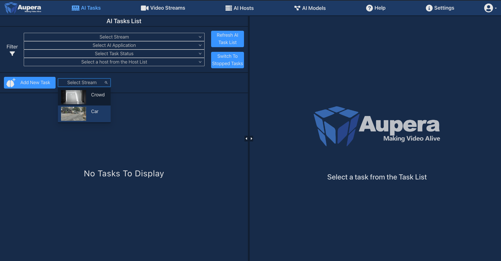
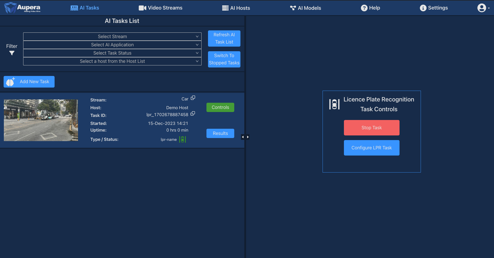
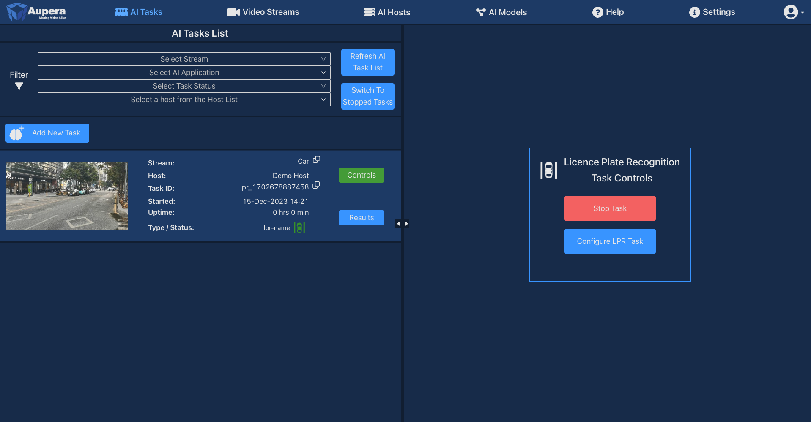
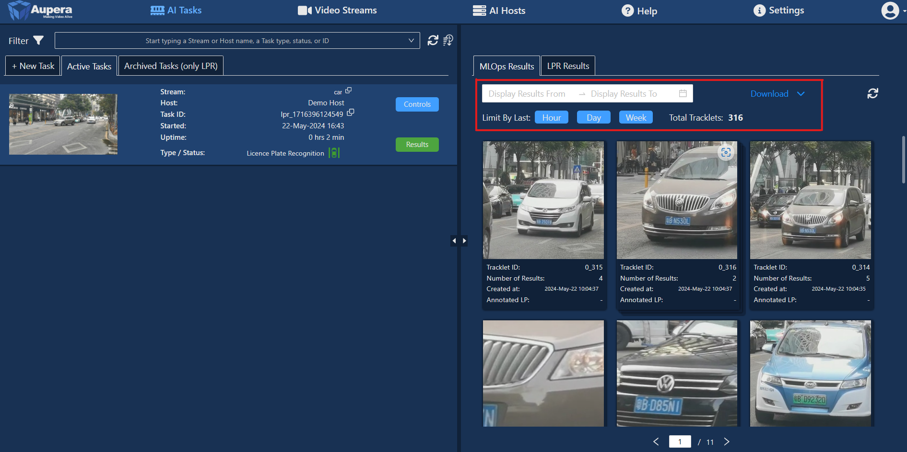

### Running Aupera’s License Plate Recognition (LPR) Application
1. If you are not in AI Tasks page, click AI Tasks, then click Add New Task button, then there will be a dropdown to select a video stream
    

        
        
<strong>Figure 2.2.1 Aupera web application page – AI Tasks Hub Page, Add New Task button clicked</strong>

    

2. After selecting a Video Stream, another drop down will appear to select an application. Select LPR to open License Plate Recognition application set up controls.
    

        
        
<strong>Figure 2.2.2 Aupera web application page – AI Tasks Hub Page, Camera Selected</strong>

    

3. After selecting LPR, another dropdown will appear to select an AI Host. Only AI hosts supporting the application selected in Application dropdown will be displayed in this dropdown. More AI Hosts may be added on the AI Hosts page. (For more information on AI Hosts page, please go to **[7. AI Hosts](#7-ai-hosts=page)**)
    

        
        
<strong>Figure 2.2.3 Aupera web application page – AI Tasks Hub Page, Application Selected</strong>

    

4. After Stream, Application, and AI Hosts are selected, the LPR Task Setup window will appear. (This is the right panel of the AI Tasks page extended, collapsing this window by clicking **Task List** or **Cancel** button will return to the previous page)

    

        
        
<strong>Figure 2.2.4 Aupera web application page – LPR task setup page</strong>

    

5. You can choose to draw a detection ROI or crop ROI to indicate the areas of image analysis and car detection. 
    1. **Detection ROI** – Area inside which actual detection of cars and LPs happens. If no Detection ROI is specified – the whole frame will be used. To Draw the Detection ROI, click the corresponding button first, then, on a point where you would like to start ROI, there are two ways to draw the first segment of ROI.
        1. Hold left-click and drag mouse to the second point, then release.
        2. Left-click once and move cursor to the second point and left-click again.

        Second and other segments are drawn the same – move a cursor to the next point, then left-click once. To finish drawing, right-click anytime. ROI will be automatically completed by drawing the last segment from the last point you clicked on to the first point.
    
    2. **Crop ROI** – Limits the input frame for the detection model, that improves performance and accuracy, especially with small objects, like license plates. If no Crop ROI specified, then the whole frame will be used. To draw this ROI, click the corresponding button, then move mouse to the point where you would like to start it. The ROI is rectangular, so you need to specify just two points. Hold left-click and move a cursor to the opposite corner or a rectangle you are drawing. Once the ROI has desirable size, release the mouse button. Note, that current version supports just an upper-left and a bottom-right corners of the ROI as starting points. In next version, an upper-right and a bottom-left starting points will be supported as well. Crop ROI has the minimal size, so refer to the overlay help on top of the frame which show the size of the area you drawn and a minimal ROI size required.
 

6. LPR task can be started without changing any parameters, but in case you would like to change some, like enable the MLOps mode, click the “Change Task Parameters” button. Note that changing any parameters can significantly affect the results received. Some parameters which can be set up there are:
    1. **Switch Model By Time** – toggle this checkbox to set up the daytime interval, that can improve LP detection during a nighttime in some situations.
    2. **Auto Crop Detection Area** – automatically crop the frame to fit the Detection ROI you specified;
    3. **MLOps Mode** – toggle this checkbox to collect raw detection data for monitoring accuracy of results and retraining purposes. Turning MLOps mode on will allow you to see the raw results and do data cleaning and labeling.
    4. **Notification Server** and **MLOps Results Server** parameters can specify urls to which LPR detection results and MLOps data will be sent correspondingly. Note, that if default values are changed, web client will not receive any results, so viewing, data labeling, and downloading could not be performed.

        

            
            
<strong>Figure 2.2.5 Aupera web application page – LPR task advanced AI parameters</strong>

        

7. To start the task, click the Submit button. After that, a pop-up message will notify you that the task was successfully launched. If the pop-up message reports an error, try launching the task with default parameters or check the settings.
 

8. If the task was launched, the task will appear in the task table on the left side of the screen

    

        
        
<strong>Figure 2.2.6 Aupera web application page – LPR task advanced AI parameters</strong>

    

9. Select a task in task list or click **Control** button on the row of the task to show the LPR Control on the right side of the screen.
    

        
        
<strong>Figure 2.2.7 Aupera web application page – LPR task advanced AI parameters</strong>

    

    **Licence Plate Recognition Task Controls** located on the right side of the page contains the following options:
    1. **Stop Task** button stops LPR task. Stop LPR Task confirmation will notify that the current task will be stopped. To proceed deleting the task, click ***OK*** button. To undo stop task, click ***Cancel*** button.
    2. **Configure LPR Task** button updates LPR task set up. Click ***Configure LPR Task*** button, then the LPR Task Setup window will appear. Any parameter of the running task can be changed. See Figure 2.2.4 to see more details in LPR Task set up. After completing the changes to LPR Task setup, click ***Update*** button to save changes. Updating task does not reset results.
 

10. To view results, click the Results button on the specific task row on the table. The right panel will load the result of the specific task selected.

    

        
        
<strong>Figure 2.2.8 Aupera web application page – LPR task result</strong>

    

    If you enabled the MLOps Mode during LPR task setup, there will be a different view for the results page. On top of the results page, you can switch between MLOps results and LP detection results. In the MLOps section you will see “tracklets”. Each tracklet represents a single car recognized by the AI. The tracklets page allows you to filter MLOps results by date, or select **Hour**, **Day**, **Week** button behind *Limit By Last* for quick filter by hour, day or week. Beside the date picker locates the **Download MLOps Results** button. MLOps results will be packaged into a tar file and downloaded into your computer once clicked. Please do not close the tab when preparing for download. 
    

        
        
<strong>Figure 2.2.9 Aupera web application page – LPR task MLOps Mode result tracklet page</strong>

    

    If file is not downloaded, it might be because the popup is blocked on the browser. To allow popup in *Chrome*:
    

        
        
<strong>Figure 2.2.10 Chrome popup – Steps to allow popup on Chrome</strong>

    

    To allow popup in *Firefox*:
    

        
        
<strong>Figure 2.2.11 Firefox popup - Steps to allow popup on Firefox</strong>

    

    To allow popup in *Microsoft Edge* (after allowing popup, download MLOps results again):
    

        
        
<strong>Figure 2.2.12 Microsoft Edge popup - Steps to allow popup on Microsoft Edge</strong>

    

    If you click on a tracklet, you will open another page specifically designed for data labelling. On top of that page there is the “Modify License Plate” input field. The correct LP, verified by a user, can be entered here. After clicking **Submit**, the corresponding field will be updated in every MLOps result related to this tracklet. Incorrect results can be excluded by clicking on the checkbox in the bottom of the result card. Click the arrow in the top-left corner of the page to return to the tracklets list. 
    

        
        
<strong>Figure 2.2.13 Aupera web application page – LPR task MLOps Mode result of a specific tracklet page</strong>

    

11. Results and parameters of any stopped task still can be accessed. Clicking the **Switch to Stopped Tasks** button in the AI Tasks will display previously stopped LPR tasks in the Tasks List. UI is the same as for running tasks, so to view, download or label results of a stopped tasks you can refer to the corresponding sections of this User Guide.
To return to running tasks click the same button, which will say **Switch to Active Tasks** this time.
    

        
        
<strong>Figure 2.2.14 Aupera web application page – Stopped Tasks button</strong>

    

 
 

