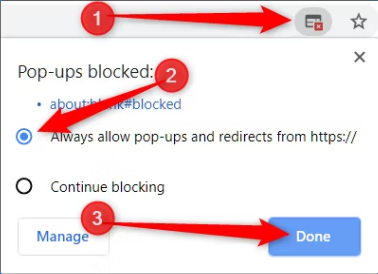

# Collect MLOps Data In Aupera’s License Plate Recognition (LPR) Application

1. Create an LPR Task with MLOps feature enabled. 
To do this, click on "Change task Parameters" and enable "MLOps Mode" checkbox. 
    - You can also enable MLOps mode if you already have an active LPR Task. 
    Click on "Controls", and then "Reconfigure LPR Task" and enable MLOps mode from there.

2. Allow some time for MLOps data to be collected.
You can view the collected images under "MLOps Data" tab. 
Each tracklet represents a single detected car.

2. Under the "MLOps Data" tab you can filter MLOps results by date. 
You can choose a date range or select **Hour**, **Day**, **Week** buttons for quick filters. 
Click on the **Download** dropdown beside the date picker and select **MLOps Results** to start downloading MLOps images in your selected time range.
    - If no date range is selected, all collected data will be downloaded
    - If it's the first time using this feature, you may need to enable popups for this website to be able to download the archive.

      

        
      

    - You can download archives up to 10GB. If you get an error indicating that the archive is larger, consider specifying a narrower time range.
    - Download will start automatically when the archive is ready, it may take some time to prepare the archive. **Do not close the tab while preparing the archive**.

# Upload and Deploy the Re-trained Model on a Host

Follow the procedure below to deploy the .tar model that you obtained from the training server to your desired host and use it in an LPR task.

1. Open the "AI Hosts" tab in the top navbar.

2. Click on the  icon in front of your host.
   This opens model management window for your host.
    - You can access the same window by clicking on the "Models Management" button when configuring a new LPR task for a host.

3. Click on "Upload Model" and select the .tar file containing the re-trained model. Wait until upload is completed.
    - You cannot upload multiple models with the same name to a host. You need to delete the old model in case you decide to upload a model with the same name.
    - The storage on the hosts is limited. You may receive errors if you upload quite a large number of models to the host and cross the storage threshold. In that case, try deleting some models.

4. After you uploaded your re-trained model successfully, you can select this model
   when creating a new task. In the LPR task configuration page, click on "Change 
   Task Parameters" and select your model from the "Model" dropdown.

# Monitor LPR Model Performance using Accuracy Reports

1. Follow the steps 1 and 2 from the first section to create an LPR task with MLOps enabled and collect some MLOps data.

2. [Optional] Under the "MLOps Data" tab you can filter MLOps results by date. 
Choose a date range or select **Hour**, **Day**, **Week** buttons for quick filters. 
    - You can do this step and the next steps in a stopped task as well. If you collected enough data, you can stop the task and find this task in the "Archived Tasks" tab.
3. Clean up and label tracklet data. Go through the tracklets one by one and do the following:
    1. Click on the **exclude** checkbox on the images where the car or license plate are not clearly visible.
    2. Type the correct license plate number in the "Modify Licence Plate" input and click submit.
    4. Do this for as many tracklets as you can. These cleaned up tracklets will be used to generate accuracy report. Ignore the tracklets that don't contain any images with a clear license plate.
4. Click on the **Download** dropdown beside the date picker and select **Accuracy Report** to start downloading the excelsheet in your selected time range.
    - If no date range is selected, all cleaned up data will be considered for the report.
    - If it's the first time using this feature, you may need to enable popups for this website to be able to download the excelsheet. See the screenshot in the first section.
    - Download will start automatically when the excel report is ready, it may take some time to prepare the excel report. **Do not close the tab while preparing the report**.
    - In some cases, after opening the excel report you may need to "enable editing" so that the formulas are calculated.

5. The downloaded excelsheet will look like the image below, with highlighted cells and reference images for wrong license plate detections

