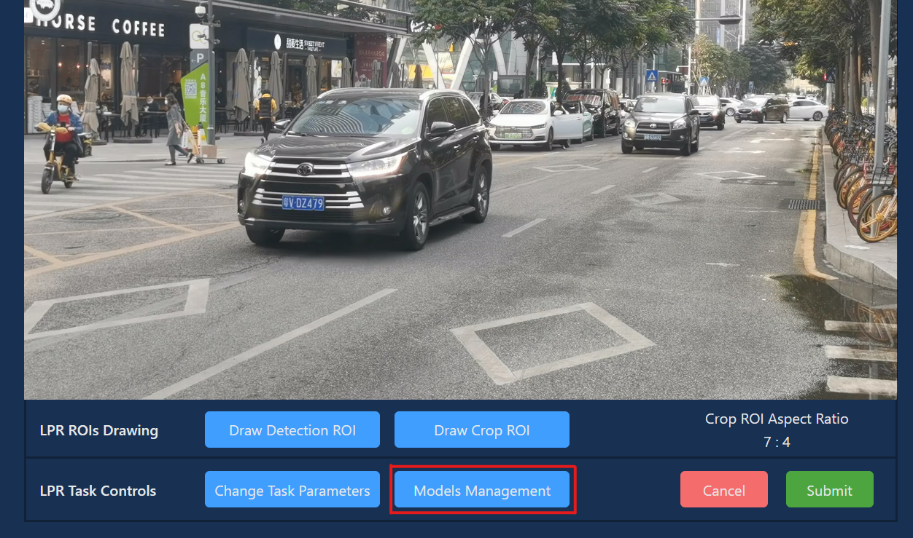
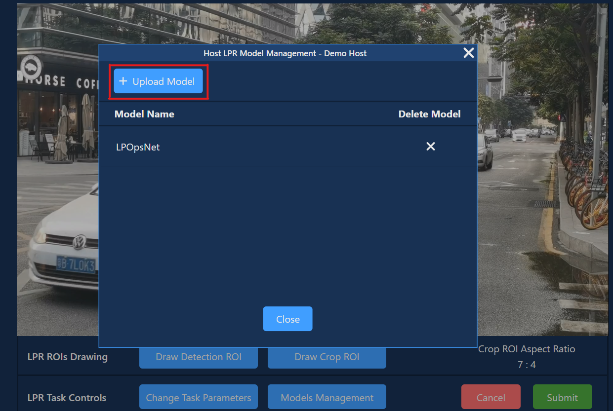

    

<h1 align="center"> VMSS 2.0 Web Application User Guide</h1>

<i>New Generation of Aupera Video Machine Learning Streaming Server</i></strong>

### Table of Content
1. [Signing Up for Aupera VMSS2.0 On Web Application](#1-signing-up-for-aupera-vmss2.0-on-web-application)
2. [Running Aupera's Proprietary Pipelines](#2-running-aupera's-proprietary-pipelines)
    1. [Running Aupera's Crowd Flow Application](#2.1-running-aupera's-crowd-flow-application)
    2. [Running Aupera's License Plate Recognition Applications](#2.2-running-aupera's-license-plate-recognition-applications)
3. [Building Your Own (Custom) Pipelines](#3-building-your-own-(custom)-pipelines)
4. [Model Zoo Evaluation](#4-model-zoo-evaluation)
5. [Running Your Own (Custom) Pipeline](#5-running-your-own-(custom)-pipeline)
6. [Using Video Streams to Add New Stream, Play Videos, or Change Snapshots](#6-using-video-streams-to-add-new-stream,-play-videos,-or-change-snapshots)
7. [AI Hosts Page](#7-ai-hosts-page)
8. [Useful Tools](#8-useful-tools)

 
 

## 1 SIGNING UP FOR AUPERA VMSS2.0 ON WEB APPLICATION

In this section, we will introduce the steps to sign-up for an account with Aupera to access Aupera Video Machine-learning Streaming Server 2.0 (VMSS2.0) instance and launch custom RTSP streams for tasks. Users can go through these steps to open the door to using the functionalities of Aupera VMSS2.0 AI pipelines in later sections.

Sign up for an account at: [https://auperatechnologies.com](https://auperatechnologies.com/)
Click the **Sign In** button on the top right corner of the page, and select **Sign Up** tab to sign up for an account.

    
    
<strong>Figure 1.1. Aupera Website sign up page</strong>

NOTE: After signing up, you need to check your email to verify your account for full access.
NOTE2: This guide assumes that you already own a hardware with Aupera's VMSS AI inference engine installed on it. If you don't have a hardware, you can request one by emailing us at [info@auperatech.com](mailto:info@auperatech.com)

After signing into VMSS2.0, you will be asked to add a video stream. Click **Add Stream** button to add video stream. Here are a few demo video streams you can try out:

* rtsp://avac.auperatechnologies.com:554/car
* rtsp://avac.auperatechnologies.com:554/crowd
* rtsp://avac.auperatechnologies.com:554/retail

Enter a **Stream URL** of your choice, give it an arbitrary and click **Save** to proceed.
###### {#add-new-stream-popup}

    
    
<strong>Figure 1.2. Aupera Web Application Add Video Stream Popup</strong>

To use the Serial Number given to you, go to **AI Hosts** tab in the nav bar. Click **Add AI Host** button to add a host. Then in the **Add by Serial Number** tab, enter an **AI Host Name** of your choice and enter the serial number in **AI Host S/N** input.

To save the AI Host, the serial number must first be first verified, click **Verify Serial Number** after all input are entered. Once the serial number has been verified, **Save AI Host** button will turn green, click to proceed.

    
    
<strong>Figure 1.3. Aupera Web Application Add New AI Host Popup</strong>

The set-up process for using VMSS 2.0 has been completed, you can proceed to trying any of our applications of your choice.

 
 

## 2 RUNNING AUPERA'S PROPRIETARY PIPELINES

In this section, we will describe the steps to run the Aupera’s Proprietary Pipelines, Crowd Flow and License Plate Recognition.

### 2.1 Running Aupera’s Crowd Flow Application

1. Click AI Tasks Hub, then click Add New Task button, then there will be a drop down to select a video stream 

    

        
        
<strong>Figure 2.1.1. Aupera web application page – AI Tasks Hub Page</strong>

    

    

        
        
<strong>Figure 2.1.2. Aupera web application page – AI Tasks Hub Page, Add New Task button clicked</strong>

    

2. After selecting a Video Stream, another drop down will appear to select an application. Select Crowd Flow to open Crowd Flow application set up controls.
    

        
        
<strong>Figure 2.1.3. Aupera web application page – AI Tasks Hub Page, Camera Selected</strong>

    

3. After selecting Crowd Flow, another dropdown will appear to select an AI Host. Only AI hosts supporting the application selected in Application dropdown (see point above) will be displayed in this dropdown. More AI Hosts may be added on the AI Hosts page. (For more information on AI Hosts page, please go to **[7. AI Hosts](#7-ai-hosts-page)**)
    

        
        
<strong>Figure 2.1.4. Aupera web application page – AI Tasks Hub Page, Application Selected</strong>

    

4. After Stream, Application, and AI Hosts are selected, the Crowd Flow Task Setup window will appear. (This is the right panel of the AI Tasks page extended, collapsing this window by clicking **Task List** or **Cancel** button. This will return to the previous page)
    

        
        
<strong>Figure 2.1.5. Aupera web application page – crowd flow task creation</strong>

    

5. You need to draw a line to indicate a border for people crossing. When a person’s head crosses the line, IN/OUT count will reflect this event. These border lines may consist of up to a maximum of 14 segments, a less segmented line provides more accurate results. In and Out directions are determined by the way a line was drawn. If line is drawn from left to right, Movement from top to bottom will be registered as “IN”, bottom to top - “OUT”.
    1. To start drawing, click the Draw Line button, the cursor will change to a cross.
    2. Left-click and hold the mouse button on the place where you would like to start the line.
    3. Drag the Line to the place where you want to finish the first segment, then release the mouse button.
    4. Move a mouse to the end of the next segment to complete it.
    5. To finish drawing, click the Right mouse button, unfinished segment will be deleted.
    *To see an animation of how this is done, click the **help** button beside **Draw Line** button*

    After the Line is drawn, “Draw Line” will change to “Redraw Line”. Click button if you want to delete the Line drawn and start drawing from the beginning. It is recommended to draw U shaped lines as shown in below to capture people who may move parallel to the line and around it.

    

        
        
<strong>Figure 2.1.6. Aupera web application page – crowd flow task lines drawing example</strong>

    
 

6. Changing Basic Parameters is not required to start the task, you can keep default values.
    1. ***Direction*** – Count people going “In”, “Out” (“Entering” / “Exiting”) or both directions
    2. ***Start/Stop Time*** – counting will be started and stopped at the given time every day;
    3. It is recommended to set ***Sensitivity*** to the default value of 0.05;
 

7. **Advanced AI Parameters** can significantly affect the results for a particular task, it is recommended to not change those until recommended by Aupera.
    

        
        
<strong>Figure 2.1.7. Aupera web application page – crowd flow task advanced AI parameters</strong>

    

8. To start the task, click the Submit button. After that, a pop-up message will notify you that the task was successfully launched. If the pop-up message reports an error, try launching the task with default parameters or check the settings.
 

9. If the task was launched, the task will appear in the task table on the left side of the screen
    

        
        
<strong>Figure 2.1.8 Aupera web application page – AI Tasks Page, Crowd Flow task started</strong>

    

10. Select a task in the task list or click control button on the row of the task to show the Crowd Flow Control on the right side of the screen.

    

        
        
<strong>Figure 2.1.9. Aupera web application page – crowd flow task control</strong>

    

    **Crowd Flow Control** contains the following options:
    * **Stop Task** button stops Crowd flow task. Stop Crowd Flow Task confirmation will notify that the current task will be stopped. To proceed deleting the task, click ***OK*** button. To undo stop task, click ***Cancel*** button.
    * **Configure CF Task** button updates Crowd Flow task set up. Click ***Configure CF Task*** button, then the Crowd Flow Task Setup window will appear. Any parameter of the running task can be changed. See Figure 2.1.6 to see more details in Crowd Flow Task set up. After completing the changes to Crowd Flow Task setup, click ***Update*** button to save changes. Updating task does not reset result counters.
    * **Open Visualizer Tool** button open graph to visualize the AI pipeline of the task. The Visualizer will open in a new tab. Then, the AI pipeline graph representing current Crowd Flow task will appear.
        

            
            
<strong>Figure 2.1.10. Aupera web application page – crowd flow task AI pipeline graph</strong>

        

11. To view results, click the result button on the specific task row on the table. The right panel will load the result of the specific task selected.
    

        
        
<strong>Figure 2.1.11 Aupera web application page – crowd flow task result</strong>

    

### 2.2 Running Aupera’s License Plate Recognition (LPR) Application
1. If you are not in AI Tasks page, click AI Tasks, then click Add New Task button, then there will be a dropdown to select a video stream
    

        
        
<strong>Figure 2.2.1 Aupera web application page – AI Tasks Hub Page, Add New Task button clicked</strong>

    

2. After selecting a Video Stream, another drop down will appear to select an application. Select LPR to open License Plate Recognition application set up controls.
    

        
        
<strong>Figure 2.2.2 Aupera web application page – AI Tasks Hub Page, Camera Selected</strong>

    

3. After selecting LPR, another dropdown will appear to select an AI Host. Only AI hosts supporting the application selected in Application dropdown will be displayed in this dropdown. More AI Hosts may be added on the AI Hosts page. (For more information on AI Hosts page, please go to **[7. AI Hosts](#7-ai-hosts=page)**)
    

        
        
<strong>Figure 2.2.3 Aupera web application page – AI Tasks Hub Page, Application Selected</strong>

    

4. After Stream, Application, and AI Hosts are selected, the LPR Task Setup window will appear. (This is the right panel of the AI Tasks page extended, collapsing this window by clicking **Task List** or **Cancel** button will return to the previous page)

    

        
        
<strong>Figure 2.2.4 Aupera web application page – LPR task setup page</strong>

    

5. You can choose to draw a detection ROI or crop ROI to indicate the areas of image analysis and car detection. 
    1. **Detection ROI** – Area inside which actual detection of cars and LPs happens. If no Detection ROI is specified – the whole frame will be used. To Draw the Detection ROI, click the corresponding button first, then, on a point where you would like to start ROI, there are two ways to draw the first segment of ROI.
        1. Hold left-click and drag mouse to the second point, then release.
        2. Left-click once and move cursor to the second point and left-click again.

        Second and other segments are drawn the same – move a cursor to the next point, then left-click once. To finish drawing, right-click anytime. ROI will be automatically completed by drawing the last segment from the last point you clicked on to the first point.
    
    2. **Crop ROI** – Limits the input frame for the detection model, that improves performance and accuracy, especially with small objects, like license plates. If no Crop ROI specified, then the whole frame will be used. To draw this ROI, click the corresponding button, then move mouse to the point where you would like to start it. The ROI is rectangular, so you need to specify just two points. Hold left-click and move a cursor to the opposite corner or a rectangle you are drawing. Once the ROI has desirable size, release the mouse button. Note, that current version supports just an upper-left and a bottom-right corners of the ROI as starting points. In next version, an upper-right and a bottom-left starting points will be supported as well. Crop ROI has the minimal size, so refer to the overlay help on top of the frame which show the size of the area you drawn and a minimal ROI size required.
 

6. LPR task can be started without changing any parameters, but in case you would like to change some, like enable the MLOps mode, click the “Change Task Parameters” button. Note that changing any parameters can significantly affect the results received. Some parameters which can be set up there are:
    1. **Switch Model By Time** – toggle this checkbox to set up the daytime interval, that can improve LP detection during a nighttime in some situations.
    2. **Auto Crop Detection Area** – automatically crop the frame to fit the Detection ROI you specified;
    3. **MLOps Mode** – toggle this checkbox will send almost all raw MLOps data as results, thus allowing you to perform data labeling in the results section.
    4. **Notification Server** and **MLOps Results Sever** parameters can specify urls to which LPR detection results and MLOps data will be sent correspondingly. Note, that if default values are changed, web client will not receive any results, so viewing, data labeling, and downloading could not be performed.

        

            
            
<strong>Figure 2.2.5 Aupera web application page – LPR task advanced AI parameters</strong>

        

7. To start the task, click the Submit button. After that, a pop-up message will notify you that the task was successfully launched. If the pop-up message reports an error, try launching the task with default parameters or check the settings.
 

8. If the task was launched, the task will appear in the task table on the left side of the screen

    

        
        
<strong>Figure 2.2.6 Aupera web application page – LPR task advanced AI parameters</strong>

    

9. Select a task in task list or click **Control** button on the row of the task to show the LPR Control on the right side of the screen.
    

        
        
<strong>Figure 2.2.7 Aupera web application page – LPR task advanced AI parameters</strong>

    

    **Licence Plate Recognition Task Controls** located on the right side of the page contains the following options:
    1. **Stop Task** button stops LPR task. Stop LPR Task confirmation will notify that the current task will be stopped. To proceed deleting the task, click ***OK*** button. To undo stop task, click ***Cancel*** button.
    2. **Configure LPR Task** button updates LPR task set up. Click ***Configure LPR Task*** button, then the LPR Task Setup window will appear. Any parameter of the running task can be changed. See Figure 2.2.4 to see more details in LPR Task set up. After completing the changes to LPR Task setup, click ***Update*** button to save changes. Updating task does not reset results.
 

10. To view results, click the Results button on the specific task row on the table. The right panel will load the result of the specific task selected.

    

        
        
<strong>Figure 2.2.8 Aupera web application page – LPR task result</strong>

    

    If you enabled the MLOps Mode during LPR task setup, there will be a different view for the results page. On top of the results page, you can switch between MLOps results and LP detection results. In the MLOps section you will see “tracklets”. Each tracklet represents a single car recognized by the AI. The tracklets page allows you to filter MLOps results by date, or select **Hour**, **Day**, **Week** button behind *Limit By Last* for quick filter by hour, day or week.
    

        
        
<strong>Figure 2.2.9 Aupera web application page – LPR task MLOps Mode result tracklet page</strong>

    

    If you click on a tracklet, you will open another page specifically designed for data labelling. On top of that page there is the “Modify License Plate” input field. The correct LP, verified by a user, can be entered here. After clicking **Submit**, the corresponding field will be updated in every MLOps result related to this tracklet. Incorrect results can be excluded by clicking on the checkbox in the bottom of the result card. Click the arrow in the top-left corner of the page to return to the tracklets list. 
    

        
        
<strong>Figure 2.2.10 Aupera web application page – LPR task MLOps Mode result of a specific tracklet page</strong>

    

11. Results and parameters of any stopped task still can be accessed. Clicking the **Switch to Stopped Tasks** button in the AI Tasks will display previously stopped LPR tasks in the Tasks List. UI is the same as for running tasks, so to view, download or label results of a stopped tasks you can refer to the corresponding sections of this User Guide.
To return to running tasks click the same button, which will say **Switch to Active Tasks** this time.
    

        
        
<strong>Figure 2.2.11 Aupera web application page – Stopped Tasks button</strong>

    

 
 

## 3 BUILDING YOUR OWN (CUSTOM) PIPELINES

1. Before running a custom pipeline task, to build a custom pipeline, click Add New Task button, select a video stream from the dropdown, and in Select Application Type dropdown, select Custom Pipeline
    

        
        
<strong>Figure 3.1 Aupera web application page – AI Tasks Hub Page, Video Stream Selected</strong>

    

2. After Stream, Application (Custom Pipeline) and AI Hosts are selected, Custom Pipeline AI Editor will appear. (This is the right panel of the AI Tasks page extended, collapsing this window by clicking Task List or cancel button will return to the previous page). In the Editor you can type a PBTEXT configuration or **Import From File** it from a file by clicking the corresponding button. You could also click **Download PBTXT** to save content of the editor.
    

        
        
<strong>Figure 3.2. Aupera web application page – custom pipeline task AI editor</strong>

    

    **Insert Node** button above the editor contains node tool kit dropdown. You can click on the input field where you want the node to be inserted or select a portion of the text where you want the it to be replaced, then select a ndoe to insert/replace from the dropdown.
    **Example Pipeline** button above the editor contains a dropdown of pre-built pipelines. The input will be entirely replaced with the example pipeline you choose from this dropdown.
    **Model Zoo** button will open a popup window which contains all the available models you can use. The input will also be entirely replaced when item is selected. Please refer to the below section for more detail on Model Zoo.
 
 

## 4 MODEL ZOO EVALUATION

1. Aside from building your own custom pipeline, you can also use our Model Zoo feature. Select Model Zoo button to look at the available models. Models can be filtered by Vendor, Category, and Type.
    

        
        
<strong>Figure 4.1. Aupera web application page – custom pipeline task AI editor Model Zoo Selected</strong>

    

    

        
        
<strong>Figure 4.2. Aupera web application page – Filter by Vendor</strong>

    

    

        
        
<strong>Figure 4.3. Aupera web application page – Filter by Category</strong>

    

    

        
        
<strong>Figure 4.4. Aupera web application page – Filter by Type</strong>

    

2. To insert the wanted model, select a model, then choose Pipeline PBTXT or Throughput PBTXT (if available). After choosing a model that is compatible with the AI host selected (for more information about AI host, go to **[7. AI Hosts](#7-ai-hosts-page)**), the Model Zoo Selector popup will automatically close, and the input will be entirely replaced with the model pbtxt selected.
    

        
        
<strong>Figure 4.5. Aupera web application page – custom pipeline task AI editor Model Zoo Selected</strong>

    

    The option **Throughput PBTXT** will run on images. It loads images that are pre-resized to match the machine learning network input size requirements into memory and loops over them. The output result of throughput PBTXT will just contain JSON/text notification.
    The option **Pipeline PBTXT** will also contain transcoding or visualization.
    For more information about the results of the custom pipeline, refer to the next section.
    NOTE: Before using Insert Node/Example Pipelines/Model Zoo, make sure that the machine has internet access.
 
 

## 5 RUNNING YOUR OWN (CUSTOM) PIPELINE

1. After completing building the custom pipeline either from scratch or model zoo, you can start running the pipeline. Before submitting the task, you can use the output URL automatically generated or enter your own Output RTSP URL (this value needs to follow a specific format of rtsp://vmss.auperatechnologies.com:554/<user_specifcied _name>). Click Submit to start the Custom Pipeline task.
NOTE: <user_specifcied_name> can be any arbitrary name that the user chooses.  
 

2. After submitting the task, if there are missing models, there will be a popup displayed informing which model is missing. Click **OK** to download model, or **Cancel** to download later.
    

        
        
<strong>Figure 5.1. Aupera web application page – Custom Pipeline Submit Task download model popup.</strong>

    

    Or, if all models are validated on current AI host, the popup will give the option to start custom pipeline task immediately. Click **OK** to start task or **Cancel** to start later.

    

        
        
<strong>Figure 5.2. Aupera web application page – Custom Pipeline Submit Task download model popup.</strong>

    

3. If the task was started, but then crashed after some time, message about that will be displayed.
    

        
        
<strong>Figure 5.3. Aupera web application page – Custom Pipeline task crashed popup.</strong>

    

4. When the task is submitted, it will appear in the task list. Depending on whether the custom pipeline task’s current status, status will show different icon.

    
    

        
<strong>Table 1.1. Aupera web application page – Custom pipeline tasks’ status icon</strong></dip>
        <table>
            <thead>
                <tr>
                    <th>Icons</th>
                    <th>Definition</th>
                    <th>Instructions</th>
                </tr>
            </thead>
            <tbody>
                <tr>
                    <td>
                        
                    </td>
                    <td>Model missing</td>
                    <td>To download missing model, select entry from table, click Open AI Editor button. Click OK on popup notification on downloading model.</td>
                </tr>
                <tr>
                    <td>
                        
                    </td>
                    <td>Model downloading</td>
                    <td>Wait until model are successfully downloaded to run task.</td>
                </tr>
                <tr>
                    <td>
                        
                    </td>
                    <td>Model ready</td>
                    <td>Model are downloaded and task is ready to run. Select entry from table, click Open AI Editor button. Click OK on popup notification on starting task.</td>
                </tr>
                <tr>
                    <td>
                        
                    </td>
                    <td>Task is running</td>
                    <td>Task is successfully running.</td>
                </tr>
                <tr>
                    <td>
                        
                    </td>
                    <td>Task failed</td>
                    <td>Task failed. Select entry from table, click Open AI Editor button. Click Stop Task button. You can restart task following start custom pipeline task instruction again.</td>
                </tr>
            </tbody>
        </table>
    

 

5. When the task row in task list or the control button on the row is clicked, the right side of the screen will show the Custom Pipeline control component.

    

        
        
<strong>Figure 5.4. Aupera web application page – custom pipeline task control</strong>

    

6. If AI Editor is opened for a running task, current PBTEXT configuration will be displayed in the editor field. However, task update is not supported now, so please stop and start the task again in case any changes in PBTEXT are required.
    

        
        
<strong>Figure 5.5. Aupera web application page – custom pipeline task pbtxt example</strong>

    

7. To see the Custom Pipeline task results, click **Result** button on the specific task in task table.
If you used the model zoo feature and submitted a pipeline pbtxt, both video result output and JSON viewer results will be displayed. If throughput pbtxt is submitted, only JSON viewer results will be displayed.
    

        
        
<strong>Figure 5.6. Aupera web application page – custom pipeline task result of model zoo throughput pbtxt</strong>

    

    

        
        
<strong>Figure 5.7. Aupera web application page – custom pipeline task result of model zoo pipeline pbtxt</strong>

    

     NOTE: After the Custom Pipeline Task started, it may take up to a few seconds before an output video stream starts. “Video failed to load” error may occur when checking custom pipeline result right after the task is started. Wait a few seconds and click the refresh button to try displaying the output video again.
    

        
        
<strong>Figure 5.8. Aupera web application page – custom pipeline task result, “Video failed to load” error</strong>

    

    

        
        
<strong>Figure 5.9. Aupera web application page – custom pipeline task result page (output video not yet available)</strong>

    

    NOTE: Refresh the page if Custom Pipeline task result failed to load after running the task for a long time.
 

8. To stop the task, click **Stop** Task in the Custom Pipeline control component.

 
 

## 6 USING VIDEO STREAMS TO ADD NEW STREAM, PLAY VIDEOS OR CHANGE SNAPSHOTS

1. Click **Video Streams**, then click Add New Stream button, then popup same as Figure 1.2 will appear for adding a new video stream.
    

        
        
<strong>Figure 6.1. Aupera web application page – Video Streams Page</strong>

    

2. To play the video, select a Stream from Video Stream List. Video playback will start immediately. If another video stream is clicked, video playback will switch to this video stream.
    

        
        
<strong>Figure 6.2. Aupera web application page – Video Stream Page, video stream selected</strong>

    

    The video can also be played and stopped by clicking the ***stop*** and ***play*** button located in the bottom right corner of the video play.

    NOTE: Video player should start playing shortly after the play button is clicked. If the video player does not start playing after clicking the play button for 10 – 15 seconds, click the stop button and play button again to restart the video play.
 

3. Video stream preview will be taken automatically in several seconds after the stream is played for the first time. To change the snapshot, click the ***camera*** button beside the play button while the video is playing.
    

        
        
<strong>Figure 6.3. Aupera web application page – Video Stream Page, snapshot taken</strong>

    

    Click **OK** button to update the snapshot or **Cancel** button to cancel updating the snapshot.
 

4. To view four video streams in the same screen, click the ***four rectangle icon*** located on the top right corner of the screen. To play video on a specific Video Player, choose a video frame by clicking directly on the video frame and select a video to play from Video Stream List, or use the Play button at the bottom right corner of each video frame to play or stop video play.
    

        
        
<strong>Figure 6.4. Aupera web application page – Video Stream Page, 4 video frames view</strong>

    

 
 

## 7 AI HOSTS PAGE

1. User can look at AI Hosts added and add new AI Hosts in AI Hosts Page.
    

        
        
<strong>Figure 7.1 Aupera web application page – AI Host Page</strong>

    

2. Information about the AI host can be checked by clicking on the entry of the AI host in AI host list.
    

        
        
<strong>Figure 7.2. Aupera web application page – AI Host Page, AI Host Info</strong>

    

3. To Add a new AI host, click on Add New AI Host button and a popup (same as Figure 1.3 will appear for user to check the AI host url to be added)
NOTE: If you need help in this step, click **Help** button for more details about each input field and the next steps.
    

        
        
<strong>Figure 7.3. Aupera web application page – AI Host Page, Add New AI Host</strong>

    

4. Enter a valid AI host name (name cannot be “default”) and URL (AI host URL should start with “http”), then click **Check AI Host** (To successfully save AI host, AI host name and URL must be verified through check AI host information)
During Check AI Host, AI host URL can be modified at any time. Then user can click **Check AI Host** button again if modification of URL is needed. 
After clicking the **Submit** button, the new added AI host will appear in the AI Host list and ready to use throughout the entire web application.
 

5. To delete an AI host, click on the **X** button on the specific AI host that are intended to be deleted on the AI host list. Then select **OK** on the delete AI host confirmation popup
NOTE: If there is no AI Host added to the web application, the user will not be able to access any task related functions. Therefore, users will not be able to access AI Tasks tab if there is no AI host added. To access and start tasks, make sure there is at least one AI host added, otherwise the AI Tasks tab will be blocked. (If you don't have a hardware, you can request one by emailing us at [info@auperatech.com](mailto:info@auperatech.com))
    

        
        
<strong>Figure 7.4. Aupera web application page – AI Host Page, No AI Host added</strong>

    

 
 

## 8 USEFUL TOOLS
1. Filter located at the top of the task list can filter items in task list. To use Filter, simply type in the input field or select an item by clicking the input field or the arrow button to filter the task list item by Video Stream, AI Application, Task Status, or AI Hosts
    

        
        
<strong>Figure 8.1 Aupera web application page – AI Tasks Hub, filter by Video Stream</strong>

    

    

        
        
<strong>Figure 8.2 Aupera web application page – AI Tasks Hub, filter by AI Application</strong>

    

    

        
        
<strong>Figure 8.3 Aupera web application page – AI Tasks Hub, filter by AI Host</strong>

    

2. Arrow buttons in the middle of the AI Tasks Hub page help adjust the ratio of the screen for a more convenient and customized view. Right arrow can be clicked to extend the table view. Left arrow can be clicked to extend what exists on the right side of the screen. When one view is extended, a bar will appear to help collapse the screen.
    

        
        
<strong>Figure 8.4. Aupera web application page – AI Tasks Hub view on smaller screen</strong>

    

    

        
        
<strong>Figure 8.5. Aupera web application page – AI Tasks Hub, table(left) view extended</strong>

    

    

        
        
<strong>Figure 8.6. Aupera web application page – AI Tasks Hub, right view extended</strong>

    

