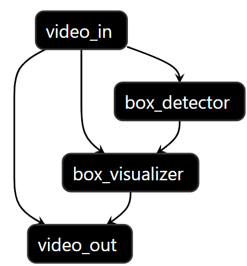

# VMSS 2.0 Docker Installation Guide for KV260/KR260 Kria SOM with Ubuntu 22.04

This guide provides step-by-step instructions for installing VMSS 2.0 Docker for K26 on KV260 or KR260 Kria SOM, using the [Kria Ubuntu Desktop 22.04 LTS Image](https://ubuntu.com/download/amd). This tutorial has been tested on both KV260 and KR260 with the image flashed using Balena Etcher on a Windows 11 machine.

## Hardware/OS requirements

- Kria SOM (KV260 or KR260) with Kria Ubuntu Desktop 22.04 LTS Image.
- 32GB storage or more (We used 128GB SanDisk Extreme PLUS 200MB/s Read SD card).
- Follow the initial setup instructions from Xilinx: [Setting up the SD Card Image](https://www.xilinx.com/products/som/kria/kv260-vision-starter-kit/kv260-getting-started-ubuntu/setting-up-the-sd-card-image.html).

## Installation Steps

### 1. Update system packages
It is recommended to update the list of packages:
   ```bash
   sudo apt-get update
   ```

Make sure to not use `sudo apt-get upgrade` after that, upgrading all the packages might casue some issues.


<!--  -->

### 2. Installing `bootgen`
Add the Xilinx's PPA to the list of your sources and install the `bootgen`:

   ```bash
   sudo add-apt-repository -y ppa:xilinx-apps/ppa
   sudo apt-get install bootgen-xlnx
   ```


### 3. Installing kria starter kit application firmware
We need to clone the starter kit repository and install it, follow these:

```bash
git clone --branch xlnx_rel_v2022.1 https://github.com/Xilinx/kria-apps-firmware.git
cd kria-apps-firmware/
sudo make -C boards/ install
cd ..
```

### 4. Load the required application
Using `xmutil` we are going to load the `kv260-benchmark-b4096` on the DPU:

```bash
sudo xmutil listapps
sudo xmutil unloadapp
sudo xmutil loadapp kv260-benchmark-b4096
sudo xmutil desktop_disable
sudo xmutil desktop_enable
```
Note that the `desktop` commands may cause the terminal to freeze for a couple of seconds. 

At this stage, we need to install the follwing dependencies:  

```bash
sudo apt-get install apt-transport-https ca-certificates curl software-properties-common -y
```

### 5. Preparing and installing the docker engine
Before pulling the docker image, follow these steps:

```bash
curl -fsSL https://download.docker.com/linux/ubuntu/gpg | sudo gpg --dearmor -o /usr/share/keyrings/docker-archive-keyring.gpg
echo   "deb [arch=arm64 signed-by=/usr/share/keyrings/docker-archive-keyring.gpg] \
https://download.docker.com/linux/ubuntu \
$(lsb_release -cs) stable" | sudo tee /etc/apt/sources.list.d/docker.list > /dev/null
sudo apt-get update
sudo apt-get install docker-ce docker-ce-cli containerd.io
```


### 6. Verify docker installation
The `hello-world` is a famous image availabe on `docker-hub`, the docker engine will automatically pull it for you:
```bash
sudo docker run hello-world
```


### 7. Pull the docker image
VMSS is available throught the public docker repository `auperastor/kria-som-dev:<TAG>`. Currently the latest avilabe `TAG` is `latest` so you can pull the latest docker by running the following command on your Kria SOM device:
```bash
sudo docker pull auperastor/kria-som-dev:latest
```
After pulling the image, you should be able to find it in the docker images list:

```bash
sudo docker images
```

### 8. Start docker container

Now we have the image and it is time to start a `container` using it.  

This docker container ideally starts with a shared directory between the host OS and the docker. For this reason, first choose or create a directory and go there and then start the docker. Here is how:

```bash
cd <SHARED-DIR> && \
sudo docker run \
    --env="DISPLAY" \
    -h "aupera-docker" \
    --env="XDG_SESSION_TYPE" \
    --cap-add sys_admin \
    --cap-add NET_ADMIN \
    --cap-add NET_RAW \
    --network=host \
    --privileged=true \
    --hostname=general \
    -v /tmp:/tmp \
    -v /dev:/dev \
    -v /sys:/sys \
    -v /etc/vart.conf:/etc/vart.conf \
    -v /lib/firmware/xilinx:/lib/firmware/xilinx \
    -v /run:/run \
    -v `pwd`:`pwd` \
    -w `pwd` \
    -e NFS_ABS_PATH=`pwd` \
    --name=<DOCKER-NAME> \
    -dit auperastor/kria-som-dev:latest bash
```

Note that `<SHARED-DIR>` is the directory that you share between host OS and docker. Also `<DOCKER-NAME>` is the name of the docker container that you want to create. You can verify that you have created and started a container, by running the following command:  

```bash
sudo docker ps -a
```

Now you can enter the docker:

```bash
sudo docker container exec -ti <DOCKER-NAME> bash
```


## Play with Aupera Web Cloud

VMSS2.0 utility consists of two major modules, Aupera Video AI Server(AVAS) and Aupera Video AI Client(AVAC). AVAS is the server that runs and manages various AI tasks, and AVAC is a web cloud application that allows users to use a friendly GUI to connect to AVAS. It only takes several simple steps to launch AVAS inside the docker and play with our AVAC after the docker is successfully built. Let's play!

**_NOTE: The following section assumes that you already entered the docker by the command listed above._**

**First, please run a single script to start AVAS.**

```bash
start.sh skip_check
```

**Then, with a single command to get the unique serial number(sn) of your device that we prepared.**

```bash
cat /opt/aupera/avas/etc/kria_som_sn.txt
```

**Next, create your own account and sign in to our Web Cloud.**

Sign up for an account at: [https://auperatechnologies.com](https://auperatechnologies.com/). 
Once you sign in with your new account, you will be asked to add a video stream. Please click the **Add Stream** button to add video streams you would like to use, or you could directly use the demo video streams we prepared for testing as listed below: 

```
rtsp://vmss.auperatechnologies.com:554/crowd
rtsp://vmss.auperatechnologies.com:554/car
rtsp://vmss.auperatechnologies.com:554/retail
```

**Last, add the device with the unique serial number and start running tasks.**

Go to the **AI Hosts** tab in the navigation bar. Click the **Add AI Host** button to add a host. 
Choose the **Add by Serial Number** tab, enter an AI Host Name of your choice, and enter the unique serial number from the last step in AI Host S/N input.

After device verification and the device is successful, you can go to the **AI Tasks** section to create your tasks and start to play!

**_NOTE: For a video and more detailed document to guide you through AVAC and creating tasks, please refer to_** 
[video guide](../../docs/avac/avac_user_guide.md)
[avac user guide document](../../docs/avac/avac_user_guide.md)

<!-- 

### 5. Execute Pipelines

Now before running the test pipeline, let's understand what we are about to run. `avaser` is VMMS's command that runs a graph/pipeline that you provide via `-c` argument. There are 3 pbtxt files that are required to pass to `avaser`:

##### Input `-i` : 
    comes after `-i` parameter and contains the same number of RTSP streams as the input_streams contained in your pipeline.pbtxt. 

##### Output `-o`: 
    comes after `-o` parameters and contains the same number of rtsp streams (or file passes) as the output_streams contained in your pipeline.pbtxt. 

##### Config `-c`: 
    comes after `-c` parameter and contains your pipeline definition (the list of nodes and connections). 

To learn more about VMSS please refer to our [user guide available here](https://auperatechvancouver.sharepoint.com/Shared%20Documents/Forms/AllItems.aspx?id=%2FShared%20Documents%2Freleases%2Fvmss2%2E0%5Favaf%5Favas%5Favac%2Fuser%5Fguides&p=true&ga=1).

It's time to run a test pipeline that runs a vehicle detector on a test RTSP video stream and watch the results on VLC(or any Video player that can run RTSP streams). First, let's navigate to the test directoy, then run the following command.


# TODO Update from here
```
cd /opt/aupera/vmss/test/box_detector_car/
```
Then let's run the pipeline. Before running this test pipeline, I highly recommed you change the output stream name defined in `output.pbtxt` by appending a unique name to the end of the stream name to avoid conflicts with other users that are trying to use the same name. If the name you define in outputbtxt is in use, the pipeline will crash. For instance, you can change the default address in `output.pbxt` to the following value by appedning your name:

```
"rtsp://vmss.auperatechnologies.com:554/car-som-out-your-name"
```

Finally, run this command:

```
avaser -i input.pbtxt -o output.pbtxt -c 1input_1output.pbtxt
```

Open VLC player on your computer and type the URL you passed to avaser as your `output.pbtxt` entry in VLC under `Media->Open Network Stream...`. You should be able to see bounding boxes overlayed around the cars in the scene. 

To illustrate the pipeline your just ran, please refer to the the following diagram: 
<div align="center">
  
</div>

In brief, all of the calculators used in your pipeline are shown above. All of these calculators can be reused to run different pipelines. For the users who may not be familiar with mux/demux, encode/decode, and filtering, to simply this further, you may think of the above diagram as a pipeline shown below where you can just copy and past the components that are summarized as `video_in` and `video_out` in any pipeline to achieve your goal.
<div align="center">
  
</div>

-->

