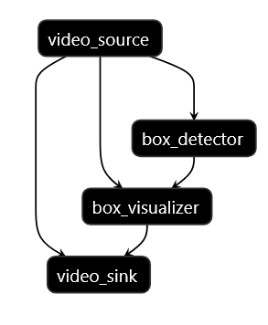
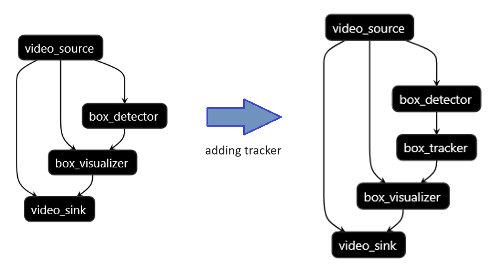
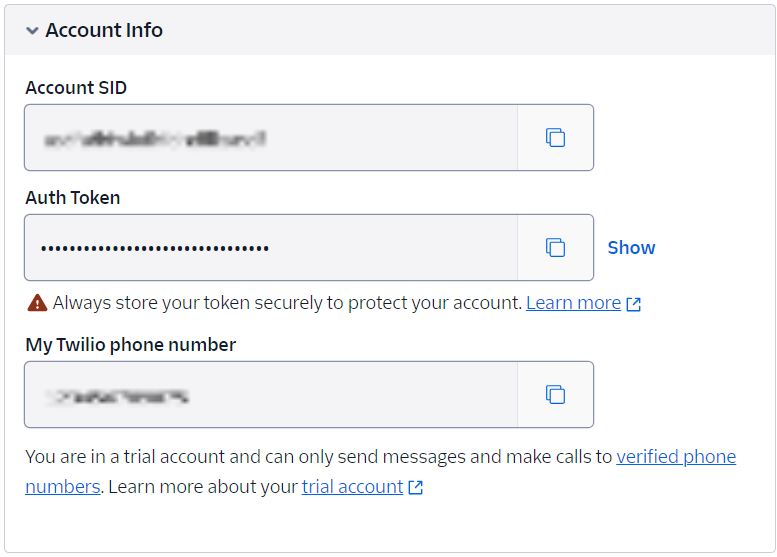

# Aupera VMSS2.0 Tutorial <!-- omit from toc -->

Welcome to the Aupera VMSS2.0 Tutorial. This guide will walk you through setting up a face detection system that can run on RTSP streams, incorporating tracking and detection interval adjustments, changing input types, modifying output actions, and switching detection models. In this tutorial our goal is to show how you can construct a pipeline based on the input and output type we select and then modify that pipeline to satisfy different needs.  

- [Prerequisite](#prerequisite)
- [Download the Required Assets](#download-the-required-assets)
- [Person Detection](#person-detection)
  - [Set up the Input and Output](#set-up-the-input-and-output)
  - [Setup an RTSP Video Player](#setup-an-rtsp-video-player)
  - [Run the Pipeline \& Watch the Results](#run-the-pipeline--watch-the-results)
  - [Providing your own Input File](#providing-your-own-input-file)
  - [Changing the Input to RTSP](#changing-the-input-to-rtsp)
- [Reconfigure the Person Detection Pipeline to do Face Detection](#reconfigure-the-person-detection-pipeline-to-do-face-detection)
- [Increasing Detection Interval and Adding a Tracker](#increasing-detection-interval-and-adding-a-tracker)
  - [Increasing Detection Interval](#increasing-detection-interval)
  - [Adding a Tracker](#adding-a-tracker)
- [Integrating SMS Notifications into the Pipeline](#integrating-sms-notifications-into-the-pipeline)
  - [Configuring your notification service](#configuring-your-notification-service)
  - [Launching your notification pipeline](#launching-your-notification-pipeline)
  - [Expanding your setup](#expanding-your-setup)
- [Changing Input from RTSP to USB](#changing-input-from-rtsp-to-usb)
  - [Visualizing USB](#visualizing-usb)
- [Working with Graph Inputs and Outputs for AVAC](#working-with-graph-inputs-and-outputs-for-avac)
  - [Setting up AVAC pipelines](#setting-up-avac-pipelines)
- [Tips and Tricks](#tips-and-tricks)
  - [Test RTSP Streams](#test-rtsp-streams)
  - [Available Models](#available-models)

## Prerequisite

Make sure you have followed our [setup procedure](../../setup/K260_Kria_SOM/) and have launched your own docker container before following the steps below. This tutorial assumes you're working inside that container, so all the steps we'll be going through should be done in there.

## Download the Required Assets

Once you're set up in the docker environment, the first step is to clone this repository to access initial `pbtxt` files essential for starting our journey:

```
git clone --single-branch https://github.com/auperatech/VMSS2.0.git
```

Next, let's proceed to download a demo mp4 file and prepare it for this tutorial:
```
cd VMSS2.0/tutorial/K260_Kria_SOM/assets
```

Successfully executing these commands will create the following directory structure.
Note that all further activities of this tutorial will take place within this assets directory.
```
./assets
├── face_demo_82s.nv12.mp4
├── images
├── notification_message_in_details.md
├── rtsp_facedetect_rtsp.pbtxt
├── rtsp_facedetect-tracker_rtsp.pbtxt
├── rtsp_facedetect-tracker_sms-rtsp.pbtxt
├── rtsp_persondetect_rtsp.pbtxt
├── usb_facedetect-tracker_rtsp.pbtxt
└── usb_facedetect-tracker_sms-rtsp.pbtxt
```

## Person Detection
The first step to create any video pipeline involves determining your desired input and output, followed by selecting the appropriate logic and, if necessary, post-processing nodes. VMSS2.0 offers a wide range of input and output options to  accommodate various needs.

In this tutorial, we are going to start with **video file** as our input. Then we will feed the processed frames to a a sequence involving a `box_detector` for detection and a `box_visualizer` for visualizing the results. As for the output, we'll utilize RTSP to stream the processed video. Below, you'll find details on supported inputs and outputs, along with the necessary nodes for processing.
<div align="center">
<figure>
  
    <br>
    <figcaption>VMSS2.0 Nodes Overview</figcaption>
</figure>
</div>

### Set up the Input and Output
 
**Input File:** For the input, we are using the `face_demo_82s.nv12.h264` file in `VMSS2.0/tutorial/K260_Kria_SOM/assets`. By editing `rtsp_persondetect_rtsp.pbtxt`, you should specify the path [on line 12](./assets/rtsp_persondetect_rtsp.pbtxt#L12) (inside the `video_source` calculator node options) as below: 

```
path: "/<path to>/face_demo_82s.nv12.h264"
```
**Output Stream:** For the output, we follow the same logic, but instead of saving the ouput to a file, we are going to stream the results live by pushing the output to Aupera's public RTSP server. To do this, simply pick any unique arbitrary name and append it to `rtsp://vmss.auperatechnologies.com:554/`. Then, include this full URL in `rtsp_persondetect_rtsp.pbtxt` [on line 93](./assets/rtsp_persondetect_rtsp.pbtxt#L93) (inside the `video_sink` options) with your output url as shown below:

```
path: "rtsp://vmss.auperatechnologies.com:554/your-output-name"
```
***NOTE:*** It's important to use a unique stream name when using the RTSP server. Ensure you replace `your-output-name` above with a name of your choosing before moving forward.

### Setup an RTSP Video Player 
Finally, make sure you have a video player available to watch your output stream. We recommend using [VLC.](https://www.videolan.org/) Launch the video player and make sure you can run a test RTSP stream. You may use any of the test streams listed [here](#test-rtsp-streams) to verify this.

***NOTE:*** In VLC you can paste one of the streams above  `Media->Open Network Stream...` and press `Play`. 

### Run the Pipeline & Watch the Results

Now that your input and output are set up and you've confirmed that you can view an RTSP stream, you're all set to proceed with this example. Execute the following command to start:

```
avaser -c rtsp_persondetect_rtsp.pbtxt
```

***NOTE:*** To stop the pipeline, press `ctrl + c`

Upon running, you can watch the output stream using VLC or an alternative by using the link you set in the `video_sink` node options (i.e `rtsp://vmss.auperatechnologies.com:554/your-output-name`). The output video should show a bounding box around each person.

In essence, `avaser` is VMMS's command that runs a graph/pipeline. `avaser` requires specifying up to three pbtxt files during execution, with the configuration pbtxt being mandatory. Here're more details about them:

- **Configuration pbtxt (specified with `-c`)**

    This configuration pbtxt is mandatory. It contains the definition of the pipeline, detailing the nodes and their interconnections.

- **Input pbtxt (specified with `-i`)**

    The input pbtxt is optional and relevant only if your pipeline has RTSP(s) or video(s) as input source(s) and a corresponding `graph_input` is specified in the configuration pbtxt. When used, the `input_urls` in the input pbtxt should specify the RTSP or video path.

- **Output pbtxt (specified with `-o`)**

    Similar to the input pbtxt, the output pbtxt is optional and dependent on your pipeline's output requirements. If you're streaming the output or saving it to a file, specify the RTSP address or file path in the `output_urls` within this file and set up a corresponding `graph_output` in the configuration pbtxt.

We already covered how to setup input and output. Now lets look more at the pipeline config file. The pipeline is a graph made from the nodes that are connected to each other based on each nodes required input/output packets. The nodes are reusable and and configurable to accomadate needs. The pipeline that you just ran is outlined in the graph shown below:
<div align="center">
<figure>
  
  <br>
    <figcaption>Detector Visualizer Pipeline</figcaption>
</figure>
</div>

### Providing your own Input File

If you wish to provide one of your own input files, you'll need to generate a .h264 file in NV12 format. We can do this using ffmpeg.

For Linux, you can install ffmpeg with the package manager of your distribution, e.g. `sudo apt-get install ffmpeg` on ubuntu.
For Windows, you can find install instructions on https://ffmpeg.org/download.html.

Then, we can convert an mp4 file to h264 format using the following:
```
ffmpeg -i my_video_in.mp4 -c:v libx264 -pix_fmt nv12 -vf scale=1920:1080 -r 30 my_video_out.nv12.h264
```

We recommend performing this conversion on a device other than the Kria SOM, as it will take a long time to run on the SOM.

### Changing the Input to RTSP

Next, we'll demonstrate how you can easily switch the input to a live RTSP stream by updating the `video_source` path. For example, you can modify line 12 to process the same demo video, but this time streamed from an RTSP source, by using the following:

```
path: "rtsp://vmss.auperatechnologies.com:554/face"
```

***NOTE:*** Optionally, feel free to experiment with different RTSP streams we've prepared [here](#test-rtsp-streams). However, in this tutorial, we'll continue to use `rtsp://vmss.auperatechnologies.com:554/face` as our go-to stream.

Now you can run the same `avaser` command you ran before by passing this new input input file:

```
avaser -c rtsp_persondetect_rtsp.pbtxt
```

## Reconfigure the Person Detection Pipeline to do Face Detection 

In the previous step you were able to run a person detector model provided via AMD Vitis AI model zoo on two different sources of input (MP4 file and RTSP Stream). In this section, we are going to run the last pipeline you just tested but change the model from a person detector to a face detector. First, we will walk you through what's needed. Then we will explain the logic behind it futher.

To adapt the pipeline for face detection, you only need to modify the following 2 values in the `rtsp_persondetect_rtsp.pbtxt` pipeline that you used in the previous step:

- [`ml_model_kernel_name`](./assets/rtsp_persondetect_rtsp.pbtxt#L23): "densebox_320_320"
- [`detector_type`](./assets/rtsp_persondetect_rtsp.pbtxt#L27): "FaceDetectDenseBox"

Once you made the changes mentioned above, execute the modified pipeline with the following command and watch the output on your video player to see the face detection in action.

```
avaser -c rtsp_persondetect_rtsp.pbtxt
```

***NOTE:*** Alternatively, you can directly execute [`rtsp_facedetect_rtsp.pbtxt`](./assets/rtsp_facedetect_rtsp.pbtxt) we prepared for a quick initiation of this step, provided you modify the `video_source` and `video_sink` input and output paths.
```
avaser -c rtsp_facedetect_rtsp.pbtxt
```

Congratulations, you just successfully reconfigured the box_detector to use a different model. The idea behind this step is to illustrates the flexibility and configurability of VMSS2.0, allowing for easy model swaps without any coding requirement. In particular, in this step, you modified our [`box_detector`](../../docs/node_guide.md#box_detector) node to run a different model. You can try any of the currently supported models [listed here](#available-models) the same way to run on your video. 

## Increasing Detection Interval and Adding a Tracker

Given some machine learning (ML) models are computationally expensive (i.e they are too slow to run on every frame in real-time), we may need to reduce how often we run our ML model. In this step, we will show you how you can reduce the frequency of running a ML model, and then we will complement the `box_detector` with a `box_tracker` to take advantage of a tracker to reduce the ML load as well as creating a unique ID for each detected object. 

### Increasing Detection Interval

Increasing the detection interval is straightforward: you adjust the `detect_interval` in your `box_detector` to a higher value. For instance, setting `detect_interval=3` results in running the ML model on every 3 frames. This can be done by changing the following line:

- [`detect_interval`](./assets/rtsp_persondetect_rtsp.pbtxt#L26): 3 

Now it's time to run the pipeline and watch the output just like the previous steps:
```
avaser -c rtsp_persondetect_rtsp.pbtxt
```
### Adding a Tracker
As you probably noticed, the output of your pipeline now only draws bounding boxes on every third frame. This is the expected behaviour as the `detect_interval` is now set to **3**. 

Let's move on and add a tracker by inserting a `box_tracker` node between the `box_detector` and `box_visualizer`. The image below illustrates what we are about to do:
<div align="center">
<figure>
  
    <br>
    <figcaption>Adding Tracker</figcaption>
</figure>
</div>

Let's make this change in the same `rtsp_persondetect_rtsp.pbtxt` we have used so far. First we insert the `box_tracker` node between the existing `box_detector` and `box_visualizer`. 

That is, the `box_tracker` below should be copied and pasted after the `box_detector`, specifically, after [this line](./assets/rtsp_persondetect_rtsp.pbtxt#L41).

```
node {
  name: "tracker"
  calculator: "box_tracker"
  input_stream: "detections_stream"
  input_stream: "detect_interval"
  output_stream: "tracks_stream"
  node_options: {
    [type.googleapis.com/aup.avaf.BoxTrackerOptions]: {
      max_keep_alive: 5
      min_hits: 1
      affinity_threshold: 0.008  
      shape_weight: 1
      position_weight: 1
      appearance_weight: 1
      shape_dist_max: 1
      position_dist_max: 1
      use_exp_cost: true
      tracker_type: "SORT++"
      min_object_area_th: 200
    }
  }
}
```


Next, we need to adjust how the nodes are linked together. At the moment, the `box_visualizer` is set to receive input directly from the `box_detector`, which isn't our current goal. Instead, we want the `box_visualizer` to receive its input from the `box_tracker`. To do this, change the `box_visualizer`'s first `input_stream` to match the `box_tracker`'s output_stream. Concretely, make sure this [value](./assets/rtsp_persondetect_rtsp.pbtxt#L46) is set to `"tracks_stream"`.

With these modifications in place, you're all set to launch the updated pipeline as before:
```
avaser -c rtsp_persondetect_rtsp.pbtxt
```

***NOTE:*** Alternatively, you can directly execute [`rtsp_facedetect-tracker_rtsp.pbtxt`](./assets/rtsp_facedetect-tracker_rtsp.pbtxt) we prepared for a quick initiation of this step. Don't forget to modify the `video_source` and `video_sink` input and output paths.
```
avaser -c rtsp_facedetect-tracker_rtsp.pbtxt
```

## Integrating SMS Notifications into the Pipeline

At this stage, let's achieve a real life application using Aupera VMSS2.0! Imagine you're not at home and want immediate alerts if someone approaches your front door, or you need to monitor your backyard for security. By adding just two nodes to your previous pipeline, you can set up a system that sends you real-time SMS alerts when your camera detects persons' faces or any specific objects you're interested in.

To accomplish this, you will need to 

1. Append two additional nodes to your pipeline at the end:

    - `to_json`: This node converts the detection/tracking metadata (like the presence of a person) into a JSON format. This is crucial for filtering and sending relevant information via SMS.

    - `notification_message`: This is where you set up the actual sending of SMS. You can customize various aspects, such as the message type, sender, receiver, and the conditions under which the message is sent. 

      For these two nodes, you can refer to [`rtsp_facedetect-tracker_sms-rtsp.pbtxt`](./assets/rtsp_facedetect-tracker_sms-rtsp.pbtxt) and copy and paste lines from [118-162](./assets/rtsp_facedetect-tracker_sms-rtsp.pbtxt#L118-L162) to your pipeline.

2. Append a task_id field to your pipeline at the end, for example:
    ```
    task_id: "SMS_PIPELINE1"
    ```

**NOTE:** For an in-depth walkthrough of setting up the sms/email notification, please refer to our [detailed guide here](./assets/notification_message_in_details.md).

### Configuring your notification service
After inserting the nodes and `task_id`, it's time to specify key parameters within the `notification_message` node:

- **Message Type and Receiver** 
  
  Define the message type as an SMS and list your phone number as the recipient.

    ```
    message_type: SMS
    receiver: ["<Your phone number>"]
    ```

- **Message Sender** 

  The message will be sent via an SMS gateway service. For this guide, we'll use [Twilio](https://www.twilio.com/en-us) to illustrate the setup process:

  - Sign up for a [Twilio free account](https://login.twilio.com/u/signup?state=hKFo2SBlLVRYTU1JNmQweDhELW5QRVk5MDVzYU5LZFZGMk5rSaFur3VuaXZlcnNhbC1sb2dpbqN0aWTZIEk4a01NU1YzNl9MbEVKOGIyUGtMTjBJcHdNMmhuZzExo2NpZNkgTW05M1lTTDVSclpmNzdobUlKZFI3QktZYjZPOXV1cks) and get a trial Twilio phone number

  - Get **Account Info** for the free trial account at bottom of the account page
    <div align="center">  </div>

  - Configure Sender Information: 
    
    With your `Twilio` account details at hand (see image above), update the corresponding fields in the `notification_message` node as follows:

      ```
      sender: "19734255123"
      sender_username: "ACf7ec64f832871ba7f8512d64bf566f68"
      sender_password: "<Auth Token>"
      server_url: "https://api.twilio.com/2010-04-01/Accounts/ACf7ec64f832871ba7f8512d64bf566f68/Messages.json"
      ```
    With the url, replace the section after `/Accounts/` with your username.

### Launching your notification pipeline
Once everything is configured, launch the pipeline with the command below to start receiving SMS alerts for the detections and watch the results in your video player.
```
avaser -c rtsp_persondetect_rtsp.pbtxt
```

***NOTE:*** You can directly adjust these parameters in [`rtsp_facedetect-tracker_sms-rtsp.pbtxt`](./assets/rtsp_facedetect-tracker_sms-rtsp.pbtxt) and execute this pbtxt for a quick initiation of this step. Don't forget to modify the `video_source` and `video_sink` input and output paths.
```
avaser -c rtsp_facedetect-tracker_sms-rtsp.pbtxt
```

###  Expanding your setup
For more detailed adjustments, including configuring email notifications and refining parameters within the `notification_message` node, refer to the comprehensive tutorial [here](./assets/notification_message_in_details.md)

## Changing Input from RTSP to USB

Let's explore how to adapt our pipeline to different video input sources. Specifically, we will transition from using an RTSP/video stream to capturing video directly from a USB camera (exposed on the som via `/dev/video0`). This opens up a realm of possibilities for different operational scenarios. Whether you're looking to monitor a live feed from a remote camera or capture video directly from a camera connected locally, this adjustment allows your pipeline to be versatile and adaptable to specific needs.

To make this transition, perform the following 2 steps:

- Replace the content lines [3-15](./assets/rtsp_persondetect_rtsp.pbtxt#L3-L15) in `rtsp_persondetect_rtsp.pbtxt` with the `video_source` node shown below:
  ```
  node {
      name: "usb_cam"
      calculator: "video_source"
      output_stream: "image_stream_bgr"
      output_stream: "bgr_infopacket"
      node_options: {
          [type.googleapis.com/aup.avaf.VideoSourceOptions]: {
          }
      }
  }
  ```

- Remove the nodes `box_visualizer` (content lines [43-78](./assets/rtsp_persondetect_rtsp.pbtxt#L43-L78))and `video_sink` (content lines [80-96](./assets/rtsp_persondetect_rtsp.pbtxt#L80-L96)), as the `video_sink` node only accepts NV12 formatted frames, which the USB camera cannot produce at this time
  

That's it! With the adjustments made, your pipeline is now prepared to accept video input straight from a USB camera. The `video_source` calculator will now look for and attempt to connect to a webcam device on `/dev/video0` on the SOM. After making sure you have a USB camera setup ready, execute the pipeline again and watch the results in your video player:
```
avaser -c rtsp_persondetect_rtsp.pbtxt
```

***NOTE:*** Alternatively, you can execute [`usb_facedetect-tracker_sms-rtsp.pbtxt`](./assets/usb_facedetect-tracker_sms-rtsp.pbtxt) we prepared for a quick initiation if you want to start from this step directly.
```
avaser -c usb_facedetect-tracker_sms-rtsp.pbtxt
```

### Visualizing USB

As noted above, we cannot use `video_sink` to visualize bgr frames, but we can use a software encoder via our `x86_enc` pipeline to do so. To do this, lets add back in `box_visualizer` and add `vfilter_node`, `x86_enc`, and `stream_mux` to our pipeline after the visualizer. Make sure to edit the output width [here](./assets/usb_facedetect-tracker_sms_visualization_rtsp.pbtxt#L112), the output height [here](./assets/usb_facedetect-tracker_sms_visualization_rtsp.pbtxt#L113), and the output fps [here](./assets/usb_facedetect-tracker_sms_visualization_rtsp.pbtxt#L114) and [here](./assets/usb_facedetect-tracker_sms_visualization_rtsp.pbtxt#L131) to match the parameters supported by your camera.

```
node {
  name: "visualizer"
  calculator: "box_visualizer"
  input_stream: "tracks_stream"
  input_stream: "image_stream_bgr"
  output_stream: "image_stream_bgr_viz"
  stream_sync: {
    drop_strategy: DROP_INCOMPLETE_PACKETS
    timeout_ms: 5000
  }
  node_options: {
    [type.googleapis.com/aup.avaf.BoxVisualizerOptions]: {
      text_color: {
        r: 255
        g: 0
        b: 0
      }
      box_color: {
        r: 255
        g: 0
        b: 0
      }
      text_offset: {
        x: 0
        y: 0
      }
      font: 0
      line_type: 0
      box_thickness: 3
      text_size: 3
    }
  }
}

node {
  name: "vfilter_node"
  calculator: "ff_vfilter"
  vendor: "Aupera"
  input_stream: "image_stream_bgr_viz"
  input_stream: "bgr_infopacket"
  output_stream: "image_stream_vfilter"
  output_stream: "video_stream_info_vfilter"
  node_options: {
    [type.googleapis.com/aup.avaf.VideoFilterOptions]: {
      roi_x: 0
      roi_y: 0
      roi_w: 0
      roi_h: 0
      opixfmt: PIXFMT_I420
      ow: 960
      oh: 540
      ofps: 12
    }
  }
}

node {
  name: "encode_node"
  calculator: "x86_enc"
  vendor: "Aupera"
  input_stream: "image_stream_vfilter"
  input_stream: "video_stream_info_vfilter"
  output_stream: "packet_stream_encode"
  output_stream: "codec_context_stream"
  node_options: {
    [type.googleapis.com/aup.avaf.VideoCodecOptions]: {
     enc: {
       codec_type: CODEC_TYPE_H264
       fps: 12
       bitrate: 100
     }
    }
  }
}

node {
  name: "mux_node"
  calculator: "stream_mux"
  vendor: "Aupera"
  input_stream: "packet_stream_encode"
  input_stream: "codec_context_stream"
  node_options: {
    [type.googleapis.com/aup.avaf.StreamMuxOptions]: {
     mux: {
       rtsp_transport: "tcp"
       auto_reconnect: true
       output_url: "<!! output path goes here !!>"
     }
    }
  }
}
```

With these adjustments, your pipeline is now prepared to stream the processed input from your USB camera. Execute the pipeline again and watch the results in your video player:
```
avaser -c rtsp_persondetect_rtsp.pbtxt
```

***NOTE:*** Alternatively, you can execute [`usb_facedetect-tracker_sms_visualization_rtsp.pbtxt`](./assets/usb_facedetect-tracker_sms_visualization_rtsp.pbtxt) we prepared for a quick initiation if you want to start from this step directly. (Be sure to adjust the output path and width/height/fps parameters beforehand):
```
avaser -c usb_facedetect-tracker_sms_visualization_rtsp.pbtxt
```

## Working with Graph Inputs and Outputs for AVAC

In addition to specifying an input path and output path in your pbtxt file, we give the option of using graph input and graph output files to allow for runtime-configurable input and output targets. This is done in the following steps:

1. Edit `rtsp_persondetect_rtsp.pbtxt` to accept graph inputs by adding the following lines after the control port:
   ```
   control_port: 51881
   graph_input: "graph_input"
   graph_output: "graph_output"
   ```
   Edit the `video_source` calculator to accept a graph input:
   ```
   node {
      calculator: "video_source"
      name: "source"
      graph_input: "graph_input"
      output_stream: "image_stream_bgr"
      output_stream: "bgr_infopacket"
      output_stream: "image_stream_nv12"
      output_stream: "nv12_infopacket"
      node_options: {
        [type.googleapis.com/aup.avaf.VideoSourceOptions]: {
          # path: "<no need for path anymore so comment it out>"
        }
      }
   }
   ```
   Edit the `video_sink` calculator to accept a graph output:
   ```
   node {
      calculator: "video_sink"
      name: "sink"
      input_stream: "image_stream_nv12_viz"
      input_stream: "nv12_infopacket"
      graph_output: "graph_output"
      node_options: {
        [type.googleapis.com/aup.avaf.VideoSinkOptions]: {
          codec_type: CODEC_TYPE_H264
          bframes: 0
          gop_size: 60
          gop_mode: "low-latency-P"
          bitrate: 3000
          rc_mode: "Low Latency"
          # path: "<no need for path anymore so comment it or remove it>"
        }
      }
   }
   ```
2. Make an input pbtxt file (i.e. `myinput.pbtxt`) with the following contents:
   ```
   input_urls: "<your path here i.e. rtsp://vmss.auperatechnologies.com:554/car>"
   ```
3. Make an output pbtxt file (i.e. `myoutput.pbtxt`) with the following contents:
   ```
   output_urls: "<your path here i.e. rtsp://vmss.auperatechnologies.com:554/my_car_test_1234>"
   ```
4. Run with:
   ```
   avaser -i myinput.pbtxt -o myoutput.pbtxt -c rtsp_persondetect_rtsp.pbtxt
   ```

You will notice that many of the commandline examples in `examples/commandline_examples/k260_kria_som` have `input.pbtxt` and `output.pbtxt` files which you can edit.

### Setting up AVAC pipelines

Any pipelines run on AVAC (our client UI for connecting to and running/monitoring pipelines on devices) always have a graph input and graph output, which must be specified in order to the input and output streams to properly connect. Ensure that any pipelines you attempt to run on AVAC have properly specified and connected the `graph_input` and `graph_output` to the `video_source` and `video_sink` respectively.

## Tips and Tricks

### Test RTSP Streams

Here's a list of RTSP streams that you can use for testing:

| Stream Name | RTSP URL |
|-------------|----------|
| Cars Street View   | rtsp://vmss.auperatechnologies.com:554/car |
| Mall Surveilance View   | rtsp://vmss.auperatechnologies.com:554/crowd |
| People's faces   | rtsp://vmss.auperatechnologies.com:554/face |
| Compiled Subset of Imagenet Samples   | rtsp://vmss.auperatechnologies.com:554/imagenet |

### Available Models

The table below displays a selection of available detection models for you to download and explore. To use the correct models with your specific hardware configuration, please follow the 2 steps at the end to select and download the appropriate model for your environment.

| Model Kernel Name    | Description                       | Total Classes | TYPE | Download Link |
|----------------------|-----------------------------------|---------------|------|-----------------------------------|
| densebox_320_320 | face detector | 2  | FaceDetectDenseBox | [link](https://www.xilinx.com/bin/public/openDownload?filename=densebox_320_320-kv260_DPUCZDX8G_ISA1_B3136-r2.5.0.tar.gz) |
| densebox_640_360 | face detector  | 2 | FaceDetectDenseBox | [link](https://www.xilinx.com/bin/public/openDownload?filename=densebox_640_360-kv260_DPUCZDX8G_ISA1_B3136-r2.5.0.tar.gz)|
| ssd_pedestrian_pruned_0_97 | person detector | 2  | SSD  | [link](https://www.xilinx.com/bin/public/openDownload?filename=ssd_pedestrian_pruned_0_97-kv260_DPUCZDX8G_ISA1_B3136-r2.5.0.tar.gz)|
| ssd_traffic_pruned_0_9 | vehicle detector | 4  | SSD  | [link](https://www.xilinx.com/bin/public/openDownload?filename=ssd_traffic_pruned_0_9-kv260_DPUCZDX8G_ISA1_B3136-r2.5.0.tar.gz) |
| ssd_mobilenet_v2 | person + vehicle detector | 11 | SSD  | [link](https://www.xilinx.com/bin/public/openDownload?filename=ssd_mobilenet_v2-kv260_DPUCZDX8G_ISA1_B3136-r2.5.0.tar.gz) |
| refinedet_baseline | person detector | 2  | RefineDet  | [link](https://www.xilinx.com/bin/public/openDownload?filename=refinedet_baseline-kv260_DPUCZDX8G_ISA1_B3136-r2.5.0.tar.gz) |
| yolov2_voc | VOC Dataset objects | 20  | YoloV2  | [link](https://www.xilinx.com/bin/public/openDownload?filename=yolov2_voc-kv260_DPUCZDX8G_ISA1_B3136-r2.5.0.tar.gz) |
| yolov2_voc_pruned_0_66 | VOC Dataset objects | 20  | YoloV2  | [link](https://www.xilinx.com/bin/public/openDownload?filename=yolov2_voc_pruned_0_66-kv260_DPUCZDX8G_ISA1_B3136-r2.5.0.tar.gz) |
| yolov3_voc | VOC Dataset objects | 20  | YoloV3  | [link](https://www.xilinx.com/bin/public/openDownload?filename=yolov3_voc-kv260_DPUCZDX8G_ISA1_B3136-r2.5.0.tar.gz) | 
| yolov3_bdd | person + vehicle detector | 10  | YoloV3  | [link](https://www.xilinx.com/bin/public/openDownload?filename=yolov3_bdd-kv260_DPUCZDX8G_ISA1_B3136-r2.5.0.tar.gz) |
| yolov3_adas_pruned_0_9 | person + vehicle detector | 10 | YoloV3  | [link](https://www.xilinx.com/bin/public/openDownload?filename=yolov3_adas_pruned_0_9-kv260_DPUCZDX8G_ISA1_B3136-r2.5.0.tar.gz) |
| yolov3_voc_tf | VOC Dataset object | 20  | YoloV3  | [link](https://www.xilinx.com/bin/public/openDownload?filename=yolov3_voc_tf-kv260_DPUCZDX8G_ISA1_B3136-r2.5.0.tar.gz) |

Download the model file (e.g., `MODEL.tar.gz`) in the `/usr/share/vitis_ai_library/models` directory and unzip it by executing the following commands in your Docker container:

```
cd /usr/share/vitis_ai_library/models
wget LINKS_PROVIDED_IN_THE_TABLE -O MODEL.tar.gz
tar -xvzf MODEL.tar.gz
```

Finally, follow the instructions in [Reconfigure the Person Detection Pipeline to do Face Detection](#reconfigure-the-person-detection-pipeline-to-do-face-detection) to replace the model in the pbtxt and explore its capabilities!
