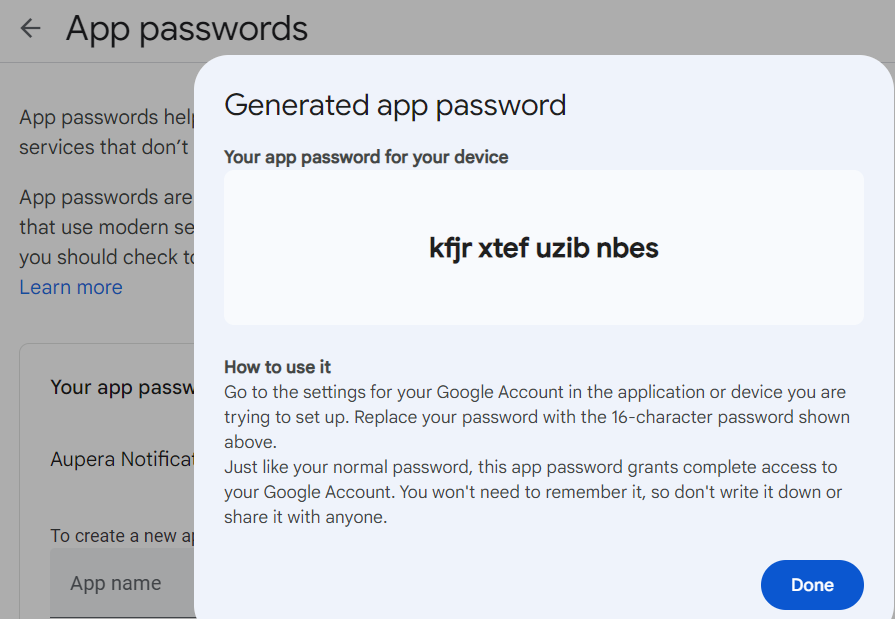
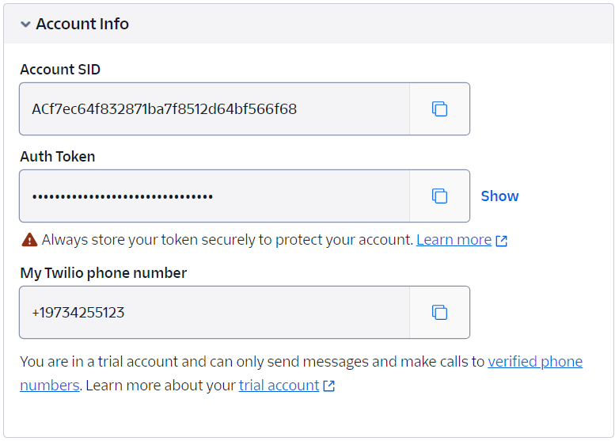

# Aupera VMSS2.0 Tutorial

Welcome to the Aupera VMSS2.0 Tutorial. This guide will walk you through setting up a face detection system that can run on RTSP streams, incorporating tracking and detection interval adjustments, changing input types, modifying output actions, and switching detection models.

## Table of Contents
- [Aupera VMSS2.0 Tutorial](#aupera-vmss20-tutorial)
  - [Table of Contents](#table-of-contents)
  - [Face Detection on RTSP Streams](#face-detection-on-rtsp-streams)
    - [Test RTSP Streams](#test-rtsp-streams)
  - [Adding a Tracker and Reducing Detection Interval](#adding-a-tracker-and-reducing-detection-interval)
  - [Changing Input from RTSP to USB](#changing-input-from-rtsp-to-usb)
  - [Adding Email or SMS Message Notification Alert](#adding-email-or-sms-message-notification-alert)
  - [Switching to Person Detection and Model Selection](#switching-to-person-detection-and-model-selection)
    - [Available Models](#available-models)
  - [Tips and Tricks](#tips-and-tricks)

## Face Detection on RTSP Streams

In this section, we will set up a face detector to run on RTSP streams and visualize the results.

### Test RTSP Streams

Here's a list of RTSP streams that you can use for testing:

| Stream Name | RTSP URL |
|-------------|----------|
| Cars Street View   | rtsp://vmss.auperatechnologies.com:554/car |
| Mall Surveilance View   | rtsp://vmss.auperatechnologies.com:554/crowd |
| Compiled Subset of Imagenet Samples   | rtsp://vmss.auperatechnologies.com:554/imagenet |

[Check example here](./k260_kria_som_pbtxt.md#face-detection-on-rtsp-streams)

## Adding a Tracker and Reducing Detection Interval

Learn how to add a tracker to the face detection pipeline and reduce the detection interval for improved performance.

[Check example here](./k260_kria_som_pbtxt.md#adding-a-tracker-and-reducing-detection-interval)

## Changing Input from RTSP to USB

This section describes how to change the input source from an RTSP stream to a USB camera.

[Check example here](./k260_kria_som_pbtxt.md#changing-input-from-rtsp-to-usb)


## Adding Email or SMS Message Notification Alert

We can also add the **notification_message** calculator to send personalized SMS/Email notifications. 

This functionality is designed to cater to the specific needs of users by enabling alerts based on custom object detection criteria. For example, when the system recognizes a certain number of predefined objects set by the customer, it triggers an automated process to send customized text messages directly to the customer. We use **[jq](https://jqlang.github.io/jq/)**, a lightweight and flexible command-line JSON processor, for users to filter the information they want based on the detected JSON packet from the running pipeline. This real-time notification system not only keeps users informed of critical events; but also adds a layer of interactivity and proactive communication.

Let's try to start sending SMS notification alerts! To enable this functionality, we need to add the **to_json** calculator and the **notification_message** calculator at the end of the pipeline. 

The **to_json** calculator is a calculator to convert metadata packets like Detection/Track Packet into JSON packets. It has 3 user-defined options: label_name_file, network, and input_type. For more details on setting the three config options, please refer to [to_json.proto](../../calculators/to_json/to_json.proto)

The **notification_message** calculator is designed to send customized JSON notifications to users through emails or SMS messages. It has the following user-defined options that need to be addressed:

- **message_type**: the value is either EMAIL or SMS, which stands for the protocol to use.
- **sender**: the value is an email address string if sending email notifications; it is a phone number string if sending SMS notifications.
- **receiver**: the value is an array of email address strings or an array of phone number strings depending on the protocol.
- **server_url**: the value is the email SMTP URL or the SMS gateway API URL depending on the protocol.
- **sender_username** and **sender_password**: the value is the credentials or authentications for connecting the server URL.
- **trigger_type**: the value is either PACKET or JQ, which stands for whether applying jq to trigger the JSON packet or not. If PACKET is selected, then the plain packet text will be sent.
- **jq_query_string**: 
- **trigger_consecutive_packet**: the expected value is a number > 0, which determines the number of packets to be sent when meeting the user-defined trigger query.
- **notification_title** and **notification_body**: the values are user-defined title and body context would like to add to the notification alert
- **attach_json**: the value is true or false, for users to choose if they want to attach the detected JSON packet contents into the SMS/Email notification or not.

To fill in the **server_url**, **sender_username,** and **sender_password**, users need to set up the email SMTP server or SMS gateway server APIs. 

Take sending Gmail emails as an example and suppose our Gmail address is aupera1234@gmail.com, the steps to set up the SMTP server are:

- Log in to the Gmail account and enable the [2-Step Verification](https://myaccount.google.com/security) under the **Security** section.

- At the bottom of the 2-Step Verification page, Add **APP passwords**. Please name the app according to your preference, maybe Aupera Notification, and create a new app-specific password.
  <div align="center">  </div>
  As shown in the figure above, the email notification information can be set as follows:

  ```
  server_url: "smtp.gmail.com:587"
  sender_username: "aupera1234@gmail.com"
  sender_password: "kfjrxtefuzibnbes"
  ```

Take sending SMS notifications as an example and using [Twilio](https://www.twilio.com/en-us) to set up the SMS Gateway APIs, the steps are as follows:

- Sign up for a [Twilio free account](https://login.twilio.com/u/signup?state=hKFo2SBlLVRYTU1JNmQweDhELW5QRVk5MDVzYU5LZFZGMk5rSaFur3VuaXZlcnNhbC1sb2dpbqN0aWTZIEk4a01NU1YzNl9MbEVKOGIyUGtMTjBJcHdNMmhuZzExo2NpZNkgTW05M1lTTDVSclpmNzdobUlKZFI3QktZYjZPOXV1cks) and get a trial Twilio phone number

- Get **Account Info** for the free trial account at bottom of the account page

  <div align="center">  </div>

  As shown in the figure above, the SMS notification information can be set as follows:

  ```
  server_url: "https://api.twilio.com/2010-04-01/Accounts/ACf7ec64f832871ba7f8512d64bf566f68/Messages.json"
  sender_username: "ACf7ec64f832871ba7f8512d64bf566f68"
  sender_password: "<Auth Token>"
  ```


Here is an example of how the to_json calculator and the notification_message calculator connect to send SMS notifications:

```
node {
  name: "to_json"
  calculator: "to_json"
  input_stream: "tracks_stream"
  output_stream: "json_stream"
  node_options: {
    [type.googleapis.com/aup.avaf.ToJsonOptions]: {
      label_name_file: ""
      network: "FaceDetectDenseBox"
      input_type: PACKET_TYPE_DETECTIONS_OR_TRACKS
    }
  }
}

node {
  name: "sms_notification"
  calculator: "notification_message"
  input_stream: "json_stream"
  node_options: {
    [type.googleapis.com/aup.avaf.NotificationMessageOptions]: {
      message_type: SMS
      sender: "1xxxxxxxxxxx"
      receiver: ["1xxxxxxxxxxx"]
      notification_q_size: 2
      sender_username: "xxxxxxxxxxxxxxxxxxxxx"
      sender_password: "xxxxxxxxxxxxxxxxxxxxx"
      server_url: "https://api.twilio.com/2010-04-01/Accounts/xxxxxxxxx/Messages.json"
      trigger: {
        trigger_type: JQ
        trigger_consecutive_packet: 3
        jq_query_string: "'select(.average_throughput_value > 20)'"
        notification_title: "sms_notification_test"
        notification_body: "xxxxxxxxxxxxxxxxxx"
        attach_json: true
      }
    }
  }
}
```

An example pipeline of sending the SMS to the user's phone when at least 4 faces are detected in a specified region is given here: [Check the example here](./k260_kria_som_pbtxt.md#adding-sms-message-notification-alert). This pipeline is used to detect person faces in the USB input video. Here is an example of the original JSON packet detected without any jq trigger applied:

```
{
  "frame": 3,
  "item_count": 2,
  "items": {
    "item 1": {
      "box_id": 1,
      "confidence": 0.9979965686798096,
      "height": 141,
      "width": 174,
      "x": 1086,
      "y": 283
    }
  },
  "network": "FaceDetectDenseBox",
  "timestamp": 3003000,
  "ts_us_offset": 100100
}
```

As shown in the `jq_query_string` in the **notification_message** calculator on the example pipeline, we use JQ to trigger the JSON packet detected. In this case, the SMS message will only be sent if 3 consecutive JSON packets meet the requirement that at least 4 faces(`item` ) are detected in the specified region `(.x >= 0 and .y >= 0 and (.x + .width) <= 1920 and (.y + .height) <= 1080)` in the video frame. 

By simply changing the `jq_query_string` input, we could achieve various jq triggers and get SMS alerts for different cases. For example, by changing the `jq_query_string` input to `'select((.items | to_entries | map(select(.value.confidence >= 1)) | length) >= 2)'`, we could achieve the case of sending SMS notifications when there are at least two faces detected with `confidence` greater or equal than one. 


## Switching to Person Detection and Model Selection

Change the pipeline to detect persons instead of faces and explore different models for detection.

### Available Models

| Model Kernel Name    | Description                       | Total Classes | TYPE |
|---------------|-----------------------------------|---------------| --------- |
| Model A       | Suitable for general person detection | 20  | YOLOV3 |
| Model B       | Optimized for low-light conditions  | NN  | SSD   |
| Model C       | High accuracy for crowded scenes   | NN  | RefineDet  |

[Check example here](./k260_kria_som_pbtxt.md#switching-to-person-detection-and-model-selection)

## Tips and Tricks

- How to read from a file
- Saving detection results to a file
- Links to example projects and additional resources

Remember to replace placeholders (like RTSP URLs and model names) with actual data and add more detailed instructions and code snippets as needed. 
