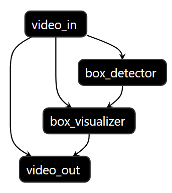
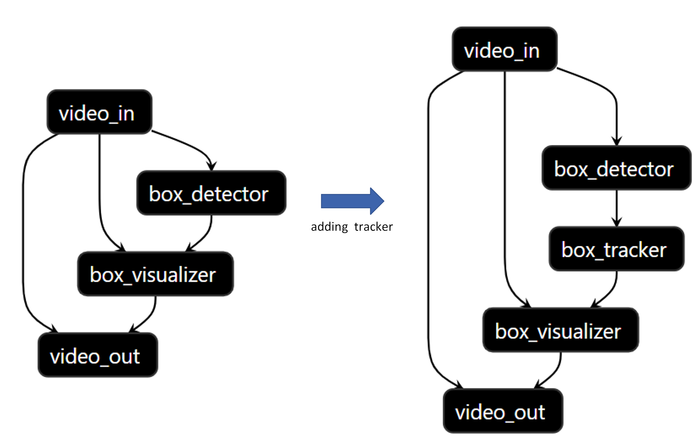
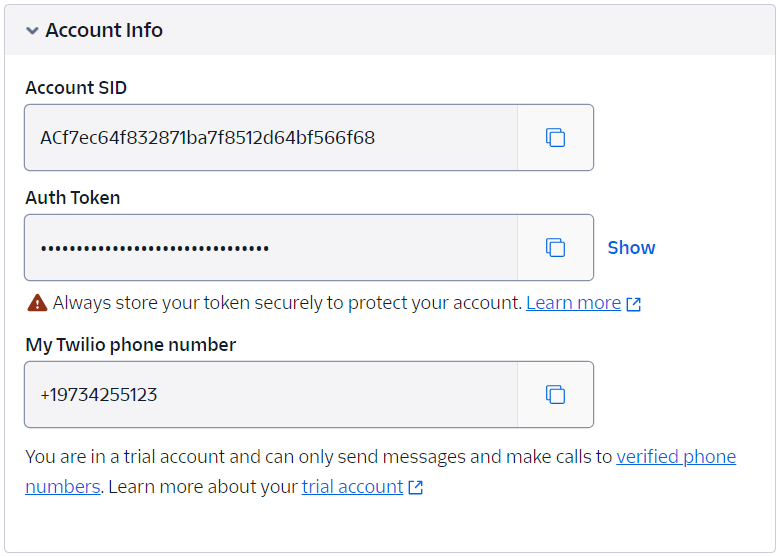

# Aupera VMSS2.0 Tutorial

Welcome to the Aupera VMSS2.0 Tutorial. This guide will walk you through setting up a face detection system that can run on RTSP streams, incorporating tracking and detection interval adjustments, changing input types, modifying output actions, and switching detection models. In this tutorial our goal is to show how you can construct a pipeline based on the input and output type we select and then modify that pipeline to satisfy different needs.  

- [Aupera VMSS2.0 Tutorial](#aupera-vmss20-tutorial)
  - [Prerequisite](#prerequisite)
  - [Download the Required Assets](#download-the-required-assets)
  - [Person Detection](#person-detection)
    - [Create the Input and Output](#create-the-input-and-output)
    - [Setup an RTSP Video Player](#setup-an-rtsp-video-player)
    - [Run the Pipeline \& Watch the Results](#run-the-pipeline--watch-the-results)
    - [Changing the Input to RTSP](#changing-the-input-to-rtsp)
  - [Reconfigure the Person Detection Pipeline to do Face Detection](#reconfigure-the-person-detection-pipeline-to-do-face-detection)
  - [Reducing Detection Interval and Adding a Tracker](#reducing-detection-interval-and-adding-a-tracker)
    - [Reducing Detction Interval](#reducing-detction-interval)
    - [Adding a Tracker](#adding-a-tracker)
  - [Changing Input from RTSP to USB](#changing-input-from-rtsp-to-usb)
  - [Integrating SMS Notifications into the Pipeline](#integrating-sms-notifications-into-the-pipeline)
  - [Tips and Tricks](#tips-and-tricks)
    - [Test RTSP Streams](#test-rtsp-streams)
    - [Available Models](#available-models)
## Prerequisite

Make sure you have followed our [setup procedure](../../setup/K260_Kria_SOM/) and you have launched your own docker container before following the steps below. The rest of this tutorial assumes that all of the commands here are executed inside the container.

## Download the Required Assets

You need to download the required assets for this tutorial. Let's start by downloading the required zipped file for this tutorial and unzip it. 

```
cd tutorial/K260_Kria_SOM
wget https://amd.vmaccel.com/object-store/v1/aup_releases/k260_tutorial_assets_20240310.zip && unzip k260_tutorial_assets_20240310.zip && rm k260_tutorial_assets_20240310.zip
```
This will produce the following directory:
```
./assets
├── face_demo_82s.mp4
├── rtsp_facedetect-tracker_rtsp.pbtxt
├── rtsp_facedetect_rtsp.pbtxt
├── rtsp_persondetect_rtsp.pbtxt
├── usb_facedetect-tracker_rtsp.pbtxt
└── usb_facedetect-tracker_sms-rtsp.pbtxt
```

## Person Detection
The first step to create any video pipeline is to determine your desired input and output. Then, you choose the appropiate logic and post processing(optional) nodes. VMSS2.0 offers a wide range of possible input and outputs. 
In this tutorial, we are going to start with **video file** as our input. Then we will feed the processed frames to a combination of `box_detector` ->  `box_visualizer`. Finally, for the output we will start with **RTSP** as our output. You can find the supported out of the box input, and output types, as well as the nodes required to process them below.
<div align="center">
<figure>
  
    <br>
    <figcaption>VMSS2.0 Nodes Overview</figcaption>
</figure>
</div>

### Create the Input and Output
 Let's create our `input.pbtxt` and `output.pbtxt` files that are required for running a pipeline. 
 
**Input File:** For the input, we are using the mp4 file you just downloaded `face_demo_82s.mp4`. Therefore, the path should be passed as `input_urls` as shown below: 

```
echo 'input_urls: "assets/face_demo_82s.mp4"' > input.pbtxt
```
**Output File:** For the output, we follow the same logic, but instead of saving the ouput in a file we are going to stream the results live by pushing the output to Aupera's public RTSP server. To do so, all you need to do is choose any unique arbitrary name and append to `rtsp://vmss.auperatechnologies.com:554/` and pass to to your `output_urls` as shown below

```
echo 'output_urls: "rtsp://vmss.auperatechnologies.com:554/your-output-name"' > output.pbtxt
```
***NOTE*** The RTSP server requires a unique stream to be used. Please change the "your-output-name" to your desired output name before proceeding to the next step. 

### Setup an RTSP Video Player 
Finally, make sure you have a video player available to watch your output stream. We recommend using [VLC.](https://www.videolan.org/) Launche the video player and make sure you can run a test RTSP stream. You can use one of our test streams to verify this step. You may use any of the test streams listed [here](#test-rtsp-streams) to verify this.

***NOTE*** In VLC you can paste one of the streams above  `Media->Open Network Stream...` and press `Play`. 

### Run the Pipeline & Watch the Results

Now that you have created your input and output files and verified you can watch an RTSP stream, you are ready to start this example. To run this example run the following command: 

```
avaser -i input.pbtxt -o output.pbtxt -c assets/rtsp_persondetect_rtsp.pbtxt
```
Upon running, you can watch the output stream using VLC or an alternative by using the link you set in your `output.pbtxt` (i.e `rtsp://vmss.auperatechnologies.com:554/your-output-name`). The output video should show a bounding box around each person.

In short, `avaser` is VMMS's command that runs a graph/pipeline. There are `3` pbtxt files that are required to pass to `avaser`:

- Config `-c`: 
    expects a pipeline config file in `.pbtxt` format that contains your pipeline definition (the list of nodes and connections). 

- Input `-i` : 
    expects your input(s) listed as pair(s) if `input_urls` and URL/File values passed a single `.pbtxt` file.

- Output `-o`: 
    expects your output(s) listed as pair(s) if `output_urls` and URL/File values passed a single `.pbtxt` file. 


In short, `avaser` is VMMS's command that runs a graph/pipeline. `avaser` requires specifying up to three pbtxt files during execution, with the configuration pbtxt being mandatory:

- **Configuration pbtxt (specified with `-c`)**

    This configuration pbtxt is mandatory. It contains the definition of the pipeline, detailing the nodes and their interconnections.

- **Input pbtxt (specified with `-i`)**

    The input pbtxt is optional and relevant only if your pipeline has RTSP(s) or video(s) as input source(s). When used, the `input_urls` in the input pbtxt should specify the RTSP or video path.

- **Output pbtxt (specified with `-o`)**

    Similar to the input pbtxt, the output pbtxt is optional and dependent on your pipeline's output requirements. When used, the `output_urls` in the output pbtxt should specify the RTSP or path you want to output the video.

We already covered how to create the input and the output files. Now we are introducing the pipeline config file. The pipeline is a graph made from the nodes that are connected to each other based on each nodes required input/output packets. The nodes are reusable and and configurable to accomadate needs. The pipeline that you just ran is describing the graph shown below:
<div align="center">
<figure>
  
  <br>
    <figcaption>Detector Visualizer Pipeline</figcaption>
</figure>
</div>


Note that in this tutorial we will be swapping the input and the output nodes. Therefore, to simplify the visualization we just show `video_in` and `video_out` as our input or output. However, keep in mind depending on the input or the ouput source type, `video_in` and `video_out` need to be swapped with the appropiate node(s). See the image ("VMSS2.0 Nodes Overview") [above](#person-detection) for more info. 


### Changing the Input to RTSP

Finally, will show how you can easily change the input stream to a live RTPS stream by changing the `input_urls`. For instance you can modify the previous `input.pbtxt` to run on a Mall RTSP stream by running the this command:

```
echo 'input_urls: "rtsp://vmss.auperatechnologies.com:554/crowd2"' > input.pbtxt
```

Now you can run the same `avaser` command you ran before by passing this new input input file:

```
avaser -i input.pbtxt -o output.pbtxt -c assets/rtsp_persondetect_rtsp.pbtxt
```

Now you can verify the new pipeline running on this new input by watching the address you set as your `output_urls` in `output.pbtxt` file.

## Reconfigure the Person Detection Pipeline to do Face Detection 

In the previous step you were able to run a person detector model provided via AMD Vitis AI model zoo on two different sources of input (MP4 file and RTSP Stream). In this section, we are going to run the last pipeline you just ran but change the model from a person detector to a face detector. First, we will walk you through what's needed. Then we will explain the logic behind it futher.

In order to reconfigure the pipeline for this purpose you only need to modify the following 3 values in   `assets/rtsp_persondetect_rtsp.pbtxt` pipeline that you used in the previous step:

- [`ml_model_kernel_name`](./assets/rtsp_persondetect_rtsp.pbtxt#L50): "densebox_320_320"
- [`detector_type`](./assets/rtsp_persondetect_rtsp.pbtxt#L54): "FaceDetectDenseBox"
- [`total_classes`](./assets/rtsp_persondetect_rtsp.pbtxt#L63): 2

Once you made the changes mentioned above, confirm your input and output urls as shown below:
```
root@general:/home/ubuntu# cat input.pbtxt
input_urls: "rtsp://vmss.auperatechnologies.com:554/crowd2"
root@general:/home/ubuntu# cat output.pbtxt
output_urls: "rtsp://vmss.auperatechnologies.com:554/your-output-name"
```
Then run the pipeline as shown before by running `avaser` and watch the results in your video player.
```
avaser -i input.pbtxt -o output.pbtxt -c assets/rtsp_persondetect_rtsp.pbtxt
```

Congratulations, you just successfully reconfigured the box_detector to use a different model. The idea behind this step was to demonstrate how VMSS2.0 pipelines can be configured without the need to code to run any of the supported models. In particular, in this step, you modified our [`box_detector`](../../docs/node_guide.md#box_classifier) node to run a different model. You can try any of the models [listed here](#available-models) the same way to run on your video. 

## Reducing Detection Interval and Adding a Tracker

Given some ML models are computationally expensive (i.e they are too slow to run on every frame in realtime) we may need to reduce how often we run our ML model. In this step, we will show you how you can reduce the frequency of running a ML model, and then we will complement the `box_detector` with a `box_tracker` to take advantage of a tracker to reduce the ML load as well as creating a unique ID for each detected object. 

### Reducing Detction Interval

To achieve this, all you need to do is set `detect_interval` in your `box_detector` to a higher value. For instance, setting `detect_interval=2` results in running the ML model on every 2 frames. This can be done by changing the following line:

- [`detect_interval`](./assets/rtsp_persondetect_rtsp.pbtxt#L53): 3 

Now it's time to run the pipeline and watch the output just like the previous steps:
```
avaser -i input.pbtxt -o output.pbtxt -c assets/rtsp_persondetect_rtsp.pbtxt
```
### Adding a Tracker
As you probably noticed, the output of your pipeline now only draws a bounding box on every other frame. This is the expected behaviour as the `detect_interval` is now set to **2**. Now, we will add a tracker by inserting a `box_tracker` node between the `box_detector` and `box_visualizer`. The image below illustrates what we are about to do:
<div align="center">
<figure>
  
    <br>
    <figcaption>Adding Tracker</figcaption>
</figure>
</div>

Now let's make this change. First we insert the  `box_tracker` node between our `box_detector` and our `box_visualizer`. 

The node below should be inserted after this [line.](./assets/rtsp_persondetect_rtsp.pbtxt#L) #TODO add correct line number

```
node {
  name: "tracker"
  calculator: "box_tracker"
  input_stream: "detections_stream"
  input_stream: "detect_interval"
  output_stream: "tracks_stream"
  node_options: {
    [type.googleapis.com/aup.avaf.BoxTrackerOptions]: {
      max_keep_alive: 5
      min_hits: 1
      affinity_threshold: 0.008  
      shape_weight: 1
      position_weight: 1
      appearance_weight: 1
      shape_dist_max: 1
      position_dist_max: 1
      use_exp_cost: true
      tracker_type: "SORT++"
      min_object_area_th: 200
    }
  }
}
```
Then we need to modify the connections between the nodes. Currently, the `box_visualizer`'s input is expecting the packets to come directly from the `box_detector` but that's not what we want. Therefore, we need to modify the input of `box_visualizer` to be connected to the output of `box_tracker`. To achieve this we need to modify the first `input_stream` in the `box_visualizer` to the `ouput_stream` of `box_tracker` which is `"tracks_stream"`. Hence, make sure this [value](./assets/rtsp_persondetect_rtsp.pbtxt#L) is set to `"tracks_stream"`. 

Now you are ready to run the new pipeline as you've done before. Let's go ahead run the pipeline and visualize the output:
```
avaser -i input.pbtxt -o output.pbtxt -c assets/rtsp_persondetect_rtsp.pbtxt
```
## Changing Input from RTSP to USB

Let's explore how to adapt our pipeline to different video input sources. Specifically, we will transition from using an RTSP/video stream to capturing video directly from a USB camera. This opens up a realm of possibilities for different operational scenarios. Whether you're looking to monitor a live feed from a remote camera or capture video directly from a camera connected locally, this adjustment allows your pipeline to be versatile and adaptable to specific needs.

To make this transition, follow these two simple steps:

- Remove RTSP Input Configuration
  
  As we are using a USB camera, we do not need receiving video/rtsp as input sources, simply remove the `graph_input: "graph_input1"` defined in your previous pbtxt

- Integrate the USB Camera Node
  
  Next, replace the nodes that were previously handling the RTSP stream—specifically, the `stream_demux` and `x86_dec` nodes—with a single `video_source` node designed to work with USB cameras. For example:
  ```
  node {
      name: "usb_cam"
      calculator: "video_source"
      output_stream: "image_stream_decode"
      output_stream: "video_stream_info_decode"
      node_options: {
          [type.googleapis.com/aup.avaf.VideoSourceOptions]: {
          }
      }
  }
  ```

That's it! With the adjustments made, your pipeline is now prepared to accept video input straight from a USB camera. Now run the execute the pipeline and watch the results in your video player.
```
avaser -o output.pbtxt -c assets/usb_facedetect-tracker_rtsp.pbtxt
```

## Integrating SMS Notifications into the Pipeline

At this stage, let's achieve a real life application using Aupera VMSS2.0! Imagine you're not at home and want immediate alerts if someone approaches your front door, or you need to monitor your backyard for security. By adding just two nodes to your previous pipeline, you can set up a system that sends you real-time SMS alerts when your camera detects persons' faces or any specific objects you're interested in.

To accomplish this, you will need to insert two additional nodes into your previous pipeline:

 - `to_json`: This node converts the detection/tracking metadata (like the presence of a person) into a JSON format. This is crucial for filtering and sending relevant information via SMS.

 - `notification_message`: This is where you set up the actual sending of SMS. You can customize various aspects, such as the message type, sender, receiver, and the conditions under which the message is sent. 

### Configuring your notification service
After inserting the nodes, it's time to specify key parameters within the `notification_message` node:

- **Message Type and Receiver** 
  
  Define the message type as an SMS and list your phone number as the recipient.

    ```
    message_type: SMS
    receiver: ["<Your phone number>"]
    ```

- **Message Sender** 

  The message will be sent via an SMS gateway service. For this guide, we'll use [Twilio](https://www.twilio.com/en-us) to illustrate the setup process:

  - Sign up for a [Twilio free account](https://login.twilio.com/u/signup?state=hKFo2SBlLVRYTU1JNmQweDhELW5QRVk5MDVzYU5LZFZGMk5rSaFur3VuaXZlcnNhbC1sb2dpbqN0aWTZIEk4a01NU1YzNl9MbEVKOGIyUGtMTjBJcHdNMmhuZzExo2NpZNkgTW05M1lTTDVSclpmNzdobUlKZFI3QktZYjZPOXV1cks) and get a trial Twilio phone number

  - Get **Account Info** for the free trial account at bottom of the account page
    <div align="center">  </div>

  - Configure Sender Information: 
    
    With your `Twilio` account details at hand (see image above), update the corresponding fields in the `notification_message` node as follows:

      ```
      sender: "19734255123"
      sender_username: "ACf7ec64f832871ba7f8512d64bf566f68"
      sender_password: "<Auth Token>"
      server_url: "https://api.twilio.com/2010-04-01/Accounts/ACf7ec64f832871ba7f8512d64bf566f68/Messages.json"
      ```

You can directly adjust these parameters in [`usb_facedetect-tracker_sms-rtsp.pbtxt`](./assets/usb_facedetect-tracker_sms-rtsp.pbtxt) for a quick initiation.

### Launching your notification pipeline
Once everything is configured, launch the pipeline with the command below to start receiving SMS alerts for the detections and watch the results in your video player.
```
avaser -o output.pbtxt -c assets/usb_facedetect-tracker_sms-rtsp.pbtxt
```

###  Expanding your setup
For more detailed adjustments, including configuring email notifications and refining parameters within the `notification_message` node, refer to the comprehensive documentation [here](./assets/notification_message_in_details.md)

## Tips and Tricks

### Test RTSP Streams

Here's a list of RTSP streams that you can use for testing:

| Stream Name | RTSP URL |
|-------------|----------|
| Cars Street View   | rtsp://vmss.auperatechnologies.com:554/car |
| Mall Surveilance View   | rtsp://vmss.auperatechnologies.com:554/crowd |
| Hallway   | rtsp://vmss.auperatechnologies.com:554/crowd2 |
| Compiled Subset of Imagenet Samples   | rtsp://vmss.auperatechnologies.com:554/imagenet |

### Available Models

| Model Kernel Name    | Description                       | Total Classes | TYPE | Download Link
|---------------|-----------------------------------|---------------| --------- | --------- |
| densebox_320_320 | face detector | 2  | FaceDetectDenseBox | [link](https://www.xilinx.com/bin/public/openDownload?filename=densebox_320_320-zcu102_zcu104_kv260-r2.5.0.tar.gz) |
| densebox_640_360 | face detector  | 2 | FaceDetectDenseBox | [link](https://www.xilinx.com/bin/public/openDownload?filename=densebox_640_360-zcu102_zcu104_kv260-r2.5.0.tar.gz) |
| ssd_pedestrian_pruned_0_97 | person detector | 2  | SSD  | [link](https://www.xilinx.com/bin/public/openDownload?filename=ssd_pedestrian_pruned_0_97-zcu102_zcu104_kv260-r2.5.0.tar.gz) |
| ssd_traffic_pruned_0_9 | vehicle detector | 4  | SSD  | [link](https://www.xilinx.com/bin/public/openDownload?filename=ssd_traffic_pruned_0_9-zcu102_zcu104_kv260-r2.5.0.tar.gz) |
| ssd_mobilenet_v2 | person + vehicle detector | 11 | SSD  | [link](https://www.xilinx.com/bin/public/openDownload?filename=ssd_mobilenet_v2-zcu102_zcu104_kv260-r2.5.0.tar.gz) |
| refinedet_baseline | person detector | 2  | RefineDet  | [link](https://www.xilinx.com/bin/public/openDownload?filename=refinedet_baseline-zcu102_zcu104_kv260-r2.5.0.tar.gz) |
| yolov2_voc | VOC Dataset objects | 20  | YoloV2  | [link](https://www.xilinx.com/bin/public/openDownload?filename=yolov2_voc-zcu102_zcu104_kv260-r2.5.0.tar.gz) |
| yolov2_voc_pruned_0_66 | VOC Dataset objects | 20  | YoloV2  | [link](https://www.xilinx.com/bin/public/openDownload?filename=yolov2_voc_pruned_0_66-zcu102_zcu104_kv260-r2.5.0.tar.gz) |
| yolov3_voc | VOC Dataset objects | 20  | YoloV3  | [link](https://www.xilinx.com/bin/public/openDownload?filename=yolov3_voc-zcu102_zcu104_kv260-r2.5.0.tar.gz) |
| yolov3_bdd | person + vehicle detector | 10  | YoloV3  | [link](https://www.xilinx.com/bin/public/openDownload?filename=yolov3_bdd-zcu102_zcu104_kv260-r2.5.0.tar.gz) |
| yolov3_adas_pruned_0_9 | person + vehicle detector | 10 | YoloV3  | [link](https://www.xilinx.com/bin/public/openDownload?filename=yolov3_adas_pruned_0_9-zcu102_zcu104_kv260-r2.5.0.tar.gz) |
| yolov3_voc_tf | VOC Dataset object | 20  | YoloV3  | [link](https://www.xilinx.com/bin/public/openDownload?filename=yolov3_voc_tf-zcu102_zcu104_kv260-r2.5.0.tar.gz) |

- How to read from a file
- Saving detection results to a file
- Links to example projects and additional resources

Remember to replace placeholders (like RTSP URLs and model names) with actual data and add more detailed instructions and code snippets as needed. 
