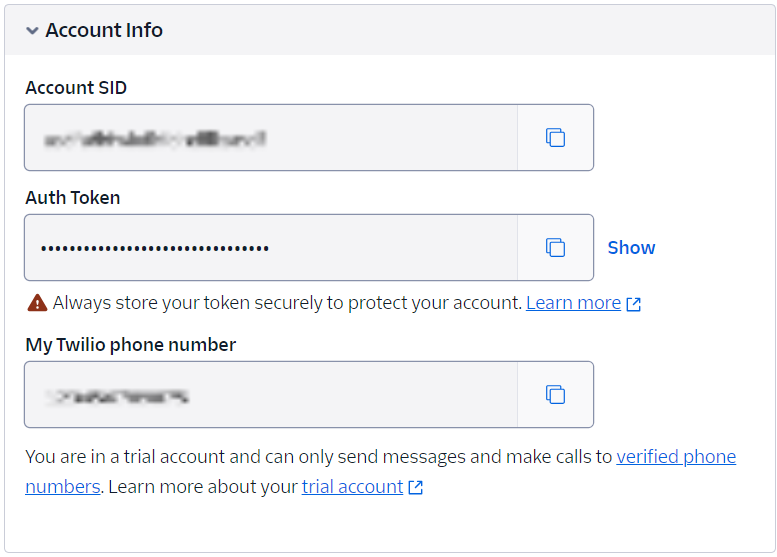

## Adding Email or SMS Message Notification Alert <!-- omit from toc -->
- [Overview of the calculators and options](#overview-of-the-calculators-and-options)
- [Filtering Options](#filtering-options)
- [Setting up the server connection](#setting-up-the-server-connection)
- [Examples](#examples)

**This is the detailed instruction on how to setup email or SMS message notification**

This functionality is designed to cater to the specific needs of users by enabling alerts based on custom object detection criteria. For example, when the system recognizes a certain number of predefined objects set by the user, it triggers an automated process to send customized text messages directly to the user. This real-time notification system not only keeps users informed of critical events; but also adds a layer of interactivity and proactive communication.

### Overview of the calculators and options

Let's try to start sending SMS notification alerts! To enable this functionality, we need to add the **to_json** calculator and the **notification_message** calculator at the end of the pipeline. 

The **to_json** calculator is a calculator to convert metadata packets like Detection/Track Packet into JSON packets. It has 3 user-defined options: label_name_file, network, and input_type. For more details on setting the three config options, please refer to [to_json](../../../docs/protos/README.md#tojsonoptions)

The **notification_message** calculator is designed to send customized JSON notifications to users through emails or SMS messages. It has the following user-defined [options](../../../docs/protos/README.md#notificationmessageoptions) that need to be addressed:

- **message_type**: the value is either EMAIL or SMS, which stands for the protocol to use.
- **server_url**: the value is the email SMTP URL or the SMS gateway API URL depending on the protocol.
- **sender**: the value is an email address string if sending email notifications; it is a phone number string if sending SMS notifications.
- **receiver**: the value is an array of email address strings or an array of phone number strings depending on the protocol.
- **sender_username** and **sender_password**: the value is the credentials or authentications for connecting the server URL.
- **trigger**: a list of triggers which will send notifications when certain conditions pass

For a given notification_message calculator we can also define a list of objects in the **trigger** option. These objects have the following user-specified [options](../../../docs/protos/README.md#notificationmessageoptionstrigger):

- **trigger_type**: the value is one of PACKET, JQ, JSON_DETECTION, JSON_TRACK, or JSON_CROWD_FLOW. This tells the trigger what type of filtering approach to use. If PACKET is selected, then the plain packet text will be sent. If JQ is selected, the jq_query_string will be used for filtering. If JSON_DETECTION, JSON_TRACK, or JSON_CROWD_FLOW are specified, then the corresponding manual options will be used for filtering.
- **jq_query_string**: The jq query that will be applied to the json packet
- **manual_detect_options**: Manual options for detection json packets
- **manual_track_options**: Manual options for tracked object json packets
- **manual_crowd_options**: Manual options for crowd flow json packets
- **trigger_consecutive_packet**: the expected value is a number > 0, which determines the number of packets to be sent when meeting the user-defined trigger query.
- **notification_title** and **notification_body**: the values are user-defined title and body context would like to add to the notification alert
- **attach_json**: the value is true or false, for users to choose if they want to attach the detected JSON packet contents into the SMS/Email notification or not.

### Filtering Options

**JQ Filtering**

We use **[jq](https://jqlang.github.io/jq/)**, a lightweight and flexible command-line JSON processor, for users to filter the information they want based on the detected JSON packet from the running pipeline. Take a look at the jq language to learn how to create custom strings for filtering specific notification packets. For instance, here is a jq query string that will filter a detected box notification based on whether it is within a specific region of the video frame:

```
'select(.items | to_entries | map(.value | select(.x >= 400 and .y >= 300 and (.x + .width) <= 800 and (.y + .height) <= 600)) | length >= 1)'
```

**Manual Filtering**

We also provide manual filtering options which specify a set of pre-defined filters. These options replace the jq filter and can run faster than JQ, but with limited flexibility in terms of filtering options. Here is an example of manual filtering options for a detected box that implements the same functionality as the earlier jq example:

```
manual_detect_options {
  min_objects: 1
  roi_x: 400
  roi_w: 400
  roi_y: 300
  roi_h: 300
}
```
Take a look at [manual_detect_options](../../../docs/protos/README.md#notificationmessageoptionstriggermanualdetectoptions), [manual_track_options](../../../docs/protos/README.md#notificationmessageoptionstriggermanualtrackoptions), and [manual_crowd_options](../../../docs/protos/README.md#notificationmessageoptionstriggermanualcrowdflowoptions) for more information on manual options.

### Setting up the server connection

To fill in the **server_url**, **sender_username,** and **sender_password**, users need to set up the email SMTP server or SMS gateway server APIs. 

Take sending Gmail emails as an example and suppose our Gmail address is aupera1234@gmail.com, the steps to set up the SMTP server are:

- Log in to the Gmail account and enable the [2-Step Verification](https://myaccount.google.com/security) under the **Security** section.

- At the bottom of the 2-Step Verification page, Add **APP passwords**. Please name the app according to your preference, maybe Aupera Notification, and create a new app-specific password.
  <div align="center">  </div>
  As shown in the figure above, the email notification information can be set as follows:

  ```
  server_url: "smtp.gmail.com:587"
  sender_username: "aupera1234@gmail.com"
  sender_password: "kfjrxtefuzibnbes"
  ```

Take sending SMS notifications as an example and using [Twilio](https://www.twilio.com/en-us) to set up the SMS Gateway APIs, the steps are as follows:

- Sign up for a [Twilio free account](https://login.twilio.com/u/signup?state=hKFo2SBlLVRYTU1JNmQweDhELW5QRVk5MDVzYU5LZFZGMk5rSaFur3VuaXZlcnNhbC1sb2dpbqN0aWTZIEk4a01NU1YzNl9MbEVKOGIyUGtMTjBJcHdNMmhuZzExo2NpZNkgTW05M1lTTDVSclpmNzdobUlKZFI3QktZYjZPOXV1cks) and get a trial Twilio phone number

- Get **Account Info** for the free trial account at bottom of the account page

  <div align="center">  </div>

  As shown in the figure above, the SMS notification information can be set as follows:

  ```
  server_url: "https://api.twilio.com/2010-04-01/Accounts/ACf7ec64f832871ba7f8512d64bf566f68/Messages.json"
  sender_username: "ACf7ec64f832871ba7f8512d64bf566f68"
  sender_password: "<Auth Token>"
  ```

### Examples

An example of how the to_json calculator and the notification_message calculator connected to send SMS notifications:

```
node {
  name: "to_json"
  calculator: "to_json"
  input_stream: "tracks_stream"
  output_stream: "json_stream"
  node_options: {
    [type.googleapis.com/aup.avaf.ToJsonOptions]: {
      label_name_file: ""
      network: "FaceDetectDenseBox"
      input_type: PACKET_TYPE_TRACKS
    }
  }
}

node {
  name: "sms_notification"
  calculator: "notification_message"
  input_stream: "json_stream"
  node_options: {
    [type.googleapis.com/aup.avaf.NotificationMessageOptions]: {
      message_type: SMS
      sender: "1xxxxxxxxxxx"
      receiver: ["1xxxxxxxxxxx"]
      sender_username: "xxxxxxxxxxxxxxxxxxxxx"
      sender_password: "xxxxxxxxxxxxxxxxxxxxx"
      server_url: "https://api.twilio.com/2010-04-01/Accounts/<sender_username>/Messages.json"
      trigger: {
        trigger_type: JSON_TRACK
        trigger_consecutive_packet: 30
        jq_query_string: ""
        notification_title: "sms_notification_alert"
        notification_body: "At least 1 faces are tracked for a long period of time for consecutive 30 packets"
        manual_track_options {
          min_objects: 1
          roi_x: 0
          roi_w: 1920
          roi_y: 0
          roi_h: 1080
          min_track_age: 1200
        }
      }
    }
  }
}
```

Here is an example of the original JSON packet detected looks like without any jq trigger applied:

```
{"json_data":[],"notification_body":"At least 1 faces are detected in a region for consecutive 5 packets","notification_title":"sms_notification_alert","task_id":"task_1710268856873"}
```

Now, we will give a real pipeline example of sending the SMS to the user's phone when at least 4 faces are detected in a specified region: [`usb_facedetect-tracker_sms-rtsp.pbtxt`](./usb_facedetect-tracker_sms-rtsp.pbtxt). This pipeline is used to detect person faces in the USB input video. 

As shown in the `jq_query_string` in the **notification_message** calculator on the example pipeline, we use JQ to trigger the JSON packet detected. In this case, the SMS message will only be sent if 3 consecutive JSON packets meet the requirement that at least 4 faces(`item` ) are detected in the specified region `(.x >= 0 and .y >= 0 and (.x + .width) <= 1920 and (.y + .height) <= 1080)` in the video frame. 

By simply changing the `jq_query_string` input, we could achieve various jq triggers and get SMS alerts for different cases. For example, by changing the `jq_query_string` input to `'select((.items | to_entries | map(select(.value.confidence >= 1)) | length) >= 2)'`, we could achieve the case of sending SMS notifications when there are at least two faces detected with `confidence` greater or equal than one. 