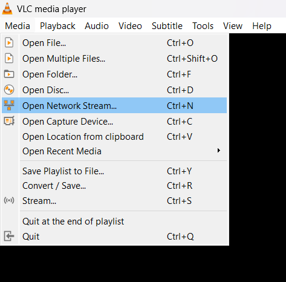
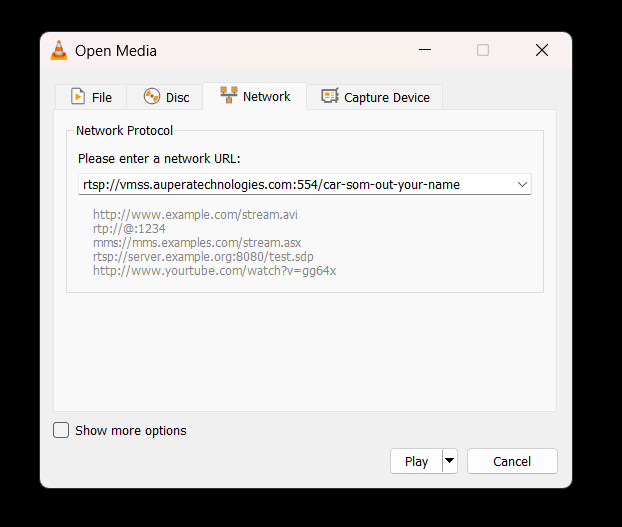
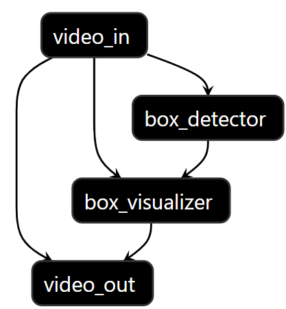
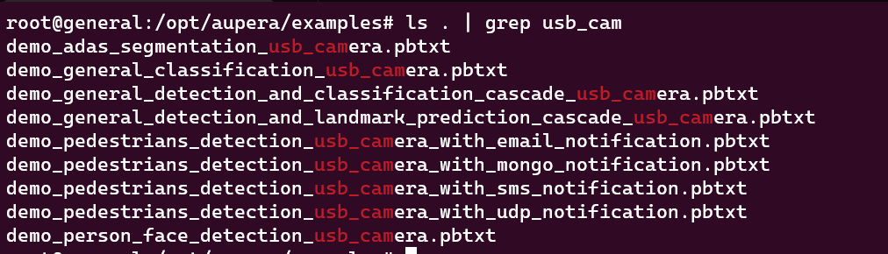
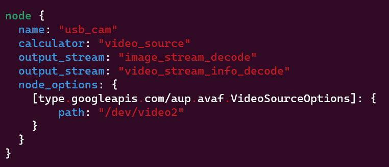

# VMSS 2.0 Docker usage guide for KV260/KR260 Kria SOM with Ubuntu 22.04

If you have not created the docker container already, please take a look at [this guide](../../setup/K260_Kria_SOM/README.md) first.


### 1. Configuration, Input, Output

Before running the test pipeline, let's understand what we are about to run.  
`avaser` is VMMS's command that runs a graph/pipeline that you provide via `-c` argument. There are `3` pbtxt files that are required to pass to `avaser`:

##### Config `-c`: 
    comes after `-c` parameter and contains your pipeline definition (the list of nodes and connections). 

##### Input `-i` : 
    comes after `-i` parameter and contains the same number of RTSP streams as the input_streams contained in your pipeline.pbtxt

##### Output `-o`: 
    comes after `-o` parameter and contains the same number of rtsp streams (or file passes) as the output_streams contained in your pipeline.pbtxt


To learn more about VMSS please refer to our [user guide available here](https://auperatechvancouver.sharepoint.com/Shared%20Documents/Forms/AllItems.aspx?id=%2FShared%20Documents%2Freleases%2Fvmss2%2E0%5Favaf%5Favas%5Favac%2Fuser%5Fguides&p=true&ga=1).

It's time to run a test pipeline that runs a vehicle detector on a test RTSP video stream and watch the results on VLC(or any other video player that can run RTSP streams).

### 2. Execute Pipelines
First, let's navigate to the test directoy, then run the following command.
<!-- # TODO Update from here -->
```bash
cd /opt/aupera/vmss/test/box_detector_car/
```

Before running this test pipeline, we highly recommed you to change the output stream name defined in `output.pbtxt` by appending a unique name to the end of the stream name to avoid conflicts with other users that are trying to use the same name. If the name you define in `output.ptxt` is in use, the pipeline will crash. For instance, you can change the default address in `output.pbxt` to the following value by appedning your name:

```
"rtsp://vmss.auperatechnologies.com:554/car-som-out-your-name"
```

Finally, run this command:

```bash
avaser -c 1input_1output.pbtxt -i input.pbtxt -o output.pbtxt
```

You will be able to see some logs on the console once you issue the above command. Let's take a look at the output in the next step.

### 3. Visual Output

While the `avaser` is running, Open VLC player on your computer and follow `Media->Open Network Stream...`:
<div align="center">
  
</div>

In the window that pops up, type the URL you passed to `avaser` as output (in your `output.pbtxt` entry), for example:
<div align="center">
  
</div>

You should be able to see the output stream on your screen.

### 3. Illustrate the Flow

To illustrate the sample pipeline you just ran, please refer to the the following diagram: 
<div align="center">
  
</div>

In summary, all of the calculators used in your pipeline are shown above. All of these calculators can be reused to run different pipelines. For the users who may not be familiar with `mux/demux`, `encode/decode`, and `filtering`, to simplify this further, you may think of the above diagram as a pipeline shown below where you can just copy and past the components that are summarized as `video_in` and `video_out` in any pipeline to achieve your goal.

<div align="center">
  
</div>

___

# Using USB Camera as input

## 1. Config files

In order to use a usb camera stream as input for the `avaser`, you first need to have suitable custom pipelines for that purpose.  
First, check whether the configuration files exist there. Follow these commands inside the docker container:

```bash
cd /opt/aupera/examples
ls . | grep usb_cam
```
You should be able see some config files there like this:
<div align="center">
  
</div>

## 2. Choosing a Camera
In case that you have connected more than one camera to your device, you might want to add the following line to your config `(.pbtxt)` file:

```bash
"path: /dev/video2"
```
It will probably look like this:
<div align="center">
  
</div>

Note that you should enter the correct path based on your system configuration.

## 3. Making sure that you have the required models
The infromation (including download links) about required models for `KV260` are availabe on a `manifest.json` file provided by Aupera. The manifest file is based on the information in the [Xilinx Vitis-AI repository](https://github.com/Xilinx/Vitis-AI/blob/2.5/model_zoo). Basically, you need to choose a model based on the `hardware_type` field (which should be equal to `xilinx_kria_som_1` in our case) and copy the `download_link`, then you can follow these steps:

```bash
cd /usr/share/vitis_ai_library/models
wget <MODEL-LINK-YOU-COPIED>
tar -xvzf <DOWNLOADED-FILE.tar.gz>
rm <DOWNLOADED-FILE.tar.gz>
```

Note that you can get the suitable `manifest.json` file using the following command:

```bash
cd /usr/share/vitis_ai_library/models
wget https://raw.githubusercontent.com/auperatech/VMSS2.0_Documentation/3.5/manifest.json
```

As a suggestion, you can use the following bash script to get all the models for you (make sure you have `jq` installed and have the `manifest.json` file downloaded):

```
#!/bin/bash

# Path to the JSON file
json_file="manifest.json"

# Check if jq is installed
if ! command -v jq &> /dev/null
then
    echo "jq could not be found. Please install jq to run this script."
    exit 1
fi

# Read each model from the JSON file
jq -c '.models[]' "$json_file" | while read -r model; do
  # Extract the hardware_type and download_link
  hardware_type=$(echo "$model" | jq -r '.hardware_type')
  download_link=$(echo "$model" | jq -r '.download_link')

  # Check if the hardware_type is what we're looking for and the download_link is not empty
  if [[ "$hardware_type" == "xilinx_kria_som_1" ]] && [[ -n "$download_link" ]]; then
    # Use wget to download the file
    wget "$download_link"

    # Extract the file name from the download link
    file_name=$(basename "$download_link")

    # Assuming the file is a tar.gz archive, extract it
    tar -xvzf "$file_name"

    # Remove the archive file
    rm -rf "$file_name"
  fi
done
```

## 4. Running the avaser
Now we are ready to run the avaser, note that you should not give an input file `-i` to avaser. So you run it like this (assuming that you have a sample `output.pbtxt` file in your working directory):

```bash
cd /opt/aupera/examples
avaser -c <CONFIG-FILE.pbtxt> -o Output.pbtxt
```

When the avaser is running, you can use the URL inside `Output.pbtxt` and give it to the VLC player as has been discussed earlier to see the visual output.
