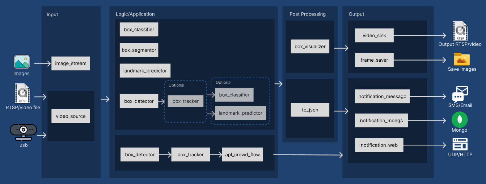

# VMSS 2.0 Docker usage guide for KV260/KR260 Kria SOM with Ubuntu 22.04

Welcome to the VMSS 2.0 Docker usage guide, tailored for the KV260/KR260 Kria SOM platform running Ubuntu 22.04. This guide is designed to help you navigate through running examples (i.e. video AI pipelines) using the VMSS 2.0 command-line interface.

- [VMSS2.0 Docker Usage Guide for KV260/KR260 Kria SOM with Ubuntu 22.04](#vmss-20-docker-usage-guide-for-kv260kr260-kria-som-with-ubuntu-2204)
  - [Prerequisite](#prerequisite)
  - [Essentials for VMSS 2.0 and avaser](#essentials-for-vmss-20-and-avaser)
    - [VMSS 2.0 diagram](#vmss-20-diagram)
    - [avaser](#avaser)
  - [Exploring Command Line Examples](#exploring-command-line-examples)
  - [Execute Pipelines (Input RTSP)](#execute-pipelines-input-rtsp)
  - [Execute Pipelines (Input Image)](#execute-pipelines-input-image)
  - [Execute Pipelines (Input USB Camera)](#execute-pipelines-input-usb-camera)
    - [Choosing a Camera](#choosing-a-camera)

## Prerequisite
Before diving into this guide, it's crucial to ensure your setup is complete and correct.  Please follow our [setup procedure](../../setup/K260_Kria_SOM) to get started with the Kria SOM platform. This includes launching a Docker container that has been specifically prepared for VMSS 2.0. This tutorial will take place entirely within this Docker container, so make sure you are working inside the container for all the following steps.

## Essentials for VMSS 2.0 and avaser
### VMSS 2.0 diagram
To begin with VMSS 2.0 for executing video pipelines, let's understand its core components. As shown in the `VMSS2.0 Nodes Overview` below, a video pipeline in VMSS 2.0 can be divided in four components: `input`, `logic/application`, `post-processing`, and `output`. This structure underscores VMSS 2.0's flexibility, catering to a wide spectrum of input and output preferences to meet diverse operational requirements.

<div align="center">
<figure>
  
    <br>
    <figcaption>VMSS2.0 Nodes Overview</figcaption>
</figure>
</div>

***NOTE:*** For an in-depth exploration of VMSS, check out our [user guide](https://auperatechvancouver.sharepoint.com/Shared%20Documents/Forms/AllItems.aspx?id=%2FShared%20Documents%2Freleases%2Fvmss2%2E0%5Favaf%5Favas%5Favac%2Fuser%5Fguides&p=true&ga=1).

### avaser
Within your Docker container, you'll use `avaser`, VMSS's dedicated tool for pipeline execution. `avaser` requires up to three `pbtxt` files for operation, with the `configuration pbtxt` being mandatory. Here's a breakdown:

- **Configuration pbtxt (specified with `-c`)**

    This configuration pbtxt is mandatory. It contains the definition of the pipeline, detailing the nodes and their interconnections.

- **Input pbtxt (specified with `-i`)**

    The input pbtxt is optional and relevant only if your pipeline has RTSP(s) or video(s) as input source(s). When used, the `input_urls` in the input pbtxt should specify the RTSP or video path.

- **Output pbtxt (specified with `-o`)**

    Similar to the input pbtxt, the output pbtxt is optional and dependent on your pipeline's output requirements. If you're streaming the output or saving it to a file, specify the RTSP address or file path in the `output_urls` within this file.


## Exploring Command Line Examples

Having outlined the video pipeline components in VMSS 2.0, let's navigate to the Docker container's interactive bash session and examine the command line examples at `/opt/aupera/examples/`

```bash
sudo docker container exec -ti vmss_docker bash
cd /opt/aupera/examples/
```

This directory houses a structured collection of directories, each containing necessary pbtxt files to initiate a pipeline directly:

```
.
├── input_image
├── input_rtsp
│   ├── input_rtsp_car
│   ├── input_rtsp_crowd
│   │   ├── app_crowd_flow
│   │   └── box_detector_crowd
│   └── input_rtsp_imagenet
└── input_usb_cam
```

Notice the three primary folders: `input_image`, `input_rtsp`, and `input_usb_cam`, each corresponding to the input types showcased in the [VMSS 2.0 Nodes Overview](#vmss-20-diagram). 
You can also find the same directories and pbtxt in this repository located [here](../../examples/commandline_examples/k260_kria_som).

In line with the [VMSS 2.0 diagram](#vmss-20-diagram), the configuration pbtxt files are named using a format that reflects their content:

`Input_(LogicOrApplication)_(PostProcessing)_Output.pbtxt`. When multiple nodes are included in a single component, their names are concatenated and separated by a hyphen (`-`). 
For example, `rtsp_detection-classification_visualization_rtsp.pbtxt` indicates a pipeline composed of four key segments:
  - `Input`: rtsp
  - `Logic/Application`: detection & classification
  - `Post-processing`: visualization
  - `Output`: rtsp

## Execute Pipelines (Input RTSP)

Now let's execute examples where RTSP serves as the input type. The `/opt/aupera/examples/input_rtsp` directory contains subdirectories each tailored to a specific RTSP stream:

| Folder Name | RTSP input | RTSP description |
|-------------|-------------|----------|
| input_rtsp_car  | rtsp://vmss.auperatechnologies.com:554/car  | Cars Street View |
| input_rtsp_crowd  |rtsp://vmss.auperatechnologies.com:554/crowd  | Mall Surveilance View   |
| input_rtsp_imagenet | rtsp://vmss.auperatechnologies.com:554/imagenet  | Compiled Subset of Imagenet Samples  |

***NOTE:*** For more information on RTSP streams and how to view them, see [this section in K260 Kria SOM tutorial](../../tutorial/K260_Kria_SOM/README.md#setup-an-rtsp-video-player)


Let's test a classification pipeline and observe the results via RTSP. Navigate to `input_rtsp_imagenet` folder and assign a unique name to your RTSP stream:

```
cd /opt/aupera/examples/input_rtsp/input_rtsp_imagenet
echo 'output_urls: "rtsp://vmss.auperatechnologies.com:554/your-output-name"' > output_rtsp.pbtxt
```

***NOTE:***: Be sure to change `your-output-name` to a unique name to prevent conflicts with others using the same RTSP address.

Execute  the `avaser` with three pbtxt files:
```
avaser -i input_rtsp.pbtxt -o output_rtsp.pbtxt -c rtsp_classification_visualization_rtsp.pbtxt
```

***NOTE:*** To terminate the pipeline, press `ctrl + c`

After launching, the output can be viewed using VLC or a similar application by navigating to the link set in your `output_rtsp.pbtxt` (i.e `rtsp://vmss.auperatechnologies.com:554/your-output-name`). You should see classification results overlaid on the top left corner of the video stream, which is a compiled selection of Imagenet samples.


Having learned how to execute `avaser` with an RTSP input and monitor the output, you can explore different pipelines within the `/opt/aupera/examples/input_rtsp`. Remember to rename the output stream in `output_rtsp.pbtxt` for each sub-directory to your unique identifier to avoid overlapping with other users. Below is a table with complete pipeline configurations using RTSP as the input:


| Directory                       | Config pbtxt                                               | Pipeline Note                                       |
|---------------------------------|------------------------------------------------------------|-----------------------------------------------------|
| input_rtsp_car                | rtsp_detection-classification_visualization_rtsp.pbtxt   | General detection and classification cascade       |
| input_rtsp_car                | rtsp_rtsp.pbtxt`                                          | Decoding and encoding of rtsp without ML models    |
| input_rtsp_car                | rtsp_segmentation_visualization_rtsp.pbtxt               | Semantic segmentation on traffic frames            |
| input_rtsp_crowd/app_crowd_flow | rtsp_detection-tracking-crowdFlowApp_visualization_email-rtsp.pbtxt | Crowd flow application with email notification ([Email alert setup guide](../../tutorial/K260_Kria_SOM/assets/notification_message_in_details.md))    |
| input_rtsp_crowd/app_crowd_flow | rtsp_detection-tracking-crowdFlowApp_visualization_mongo-rtsp.pbtxt | Crowd flow application with mongo notification    |
| input_rtsp_crowd/app_crowd_flow | rtsp_detection-tracking-crowdFlowApp_visualization_sms-rtsp.pbtxt | Crowd flow application with SMS notification ([SMS alert setup guide](../../tutorial/K260_Kria_SOM/assets/notification_message_in_details.md))    |
| input_rtsp_crowd/app_crowd_flow | rtsp_detection-tracking-crowdFlowApp_visualization_udp-rtsp.pbtxt | Crowd flow application with UDP notification       |
| input_rtsp_crowd/box_detector_crowd | rtsp_detection-landmark_visualization_rtsp.pbtxt          | Person detection, then prediction of pose landmarks |
| input_rtsp_crowd/box_detector_crowd | rtsp_detection_visualization_images-rtsp.pbtxt            | Person detection, save result frames locally (`/tmp/saved_frames`) |
| input_rtsp_crowd/box_detector_crowd | rtsp_detection_visualization_rtsp.pbtxt                   | Person detection                                    |
| input_rtsp_crowd/box_detector_crowd | rtsp_detection_visualization-toJson_mongo-rtsp.pbtxt      | Person detection with MongoDB notification upon detection |
| input_rtsp_imagenet            | rtsp_classification_visualization_rtsp.pbtxt              | General classification                              |


Try above examples via `avaser` using this format:
```
avaser -i input_rtsp.pbtxt -o output_rtsp.pbtxt -c <config.pbtxt>
```


## Execute Pipelines (Input Image)

In addition to video streams, the `image_stream` node allows us to input static images into our pipeline. Within the `/opt/aupera/examples/input_image` directory, there's a pipeline named `image_classification-throughput_udp.pbtxt`. This configuration pbtxt is designed to measure the throughput of `resnet18`, which is widely recognized as a benchmark classification model. To execute this, use the command below:

```
cd /opt/aupera/examples/input_image
avaser -c image_classification-throughput_udp.pbtxt
```

Let the pipeline run for a short duration, and it will automatically log the throughput metrics of the model into a JSON file, for this instance at `/tmp/resnet18_throughput.json`. To view the recorded throughput data, simply open the JSON file:

```
root@general:/opt/aupera/examples/input_image# cat /tmp/resnet18_throughput.json
{"stream_size":[],"throughput":{"average_throughput_value":xxxxx,"total_num_packets":xxxx},"timestamp":"xxxx-xx-xx xx:xx:xx"}
```

Understanding the computational demands of different models is advantageous. By gauging the throughput of a model that interests you, you're better informed when selecting the most appropriate model for your pipeline requirements.


## Execute Pipelines (Input USB Camera)
Finally, let's navigate to the `input_usb_cam` directoy. As you turn to executing pipelines that use a USB camera as the pipeline input, ensure that your USB camera is properly set up with your system.

### Choosing a Camera
If multiple cameras are connected to your device, you may need to specify the video source path in the `video_source` node. For example, to choose a specific camera, you would add its path (e.g. `path: /dev/video2`) to the node options. Here's how:

```bash
node {
  name: "usb_cam"
  calculator: "video_source"
  output_stream: "image_stream_decode"
  output_stream: "video_stream_info_decode"
  node_options: {
    [type.googleapis.com/aup.avaf.VideoSourceOptions]: {
      path: "/dev/video2" # # Add this line to specify the video source path explicitly.
    }
  }
}

```

If there's no need to select a specific camera, you can proceed with the default settings provided in the configuration files within the `/opt/aupera/examples/input_usb_cam` directory.

To execute a pipeline with a USB input, you'll need to specify the output and configuration pbtxt files as shown here:

```
avaser -o output_rtsp.pbtxt -c <config.pbtxt>
```
Again, be sure to assign a unique name to your output stream in `output_rtsp.pbtxt` to prevent conflicts with other users.

Below is a table listing the available pipelines in `/opt/aupera/examples/input_usb_cam` that utilize USB camera as input source

| Config pbtxt                                           | Pipeline Note                                                  |
|--------------------------------------------------------|----------------------------------------------------------------|
| usb_classification_visualization_rtsp.pbtxt            | General classification                                         |
| usb_detection-classification_visualization_rtsp.pbtxt  | General detection and classification cascade                  |
| usb_detection-landmark_visualization_rtsp.pbtxt        | Person detection, then prediction of pose landmarks            |
| usb_detection_visualization_images-rtsp.pbtxt          | Face detection, save result frames  locally (`/tmp/saved_frames`)   |
| usb_detection_visualization_rtsp.pbtxt                 | Face detection                                                 |
| usb_detection_visualization-toJson_email-rtsp.pbtxt    | Person detection with email notification upon detection ([Email alert setup guide](../../tutorial/K260_Kria_SOM/assets/notification_message_in_details.md))   |
| usb_detection_visualization-toJson_mongo-rtsp.pbtxt    | Person detection with MongoDB notification upon detection  |
| usb_detection_visualization-toJson_sms-rtsp.pbtxt      | Person detection with SMS notification upon detection ([SMS alert setup guide](../../tutorial/K260_Kria_SOM/assets/notification_message_in_details.md))     |
| usb_detection_visualization-toJson_udp-rtsp.pbtxt      | Person detection with UDP notification upon detection      |
| usb_segmentation_visualization_rtsp.pbtxt              | Semantic segmentation on traffic frames                        |
